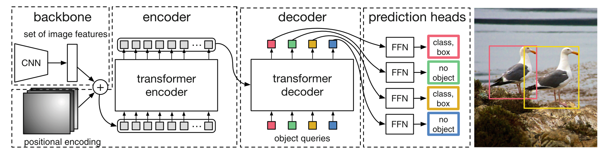
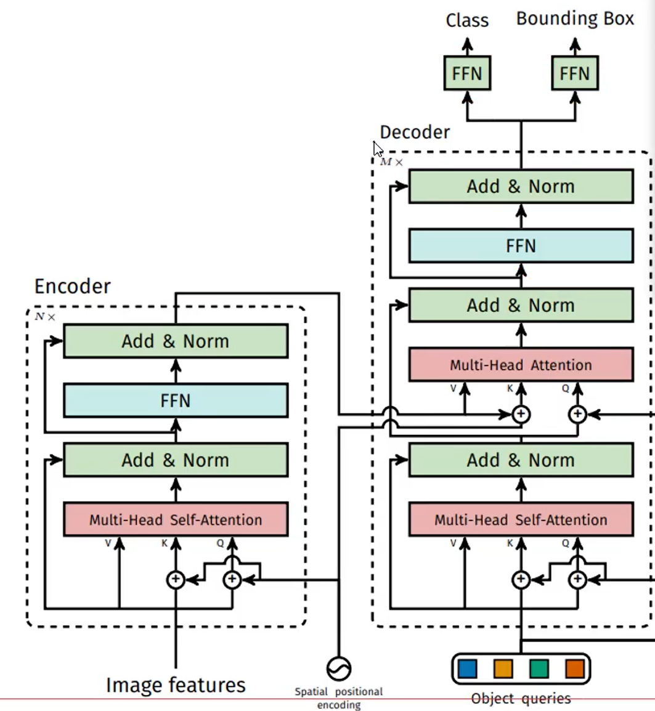
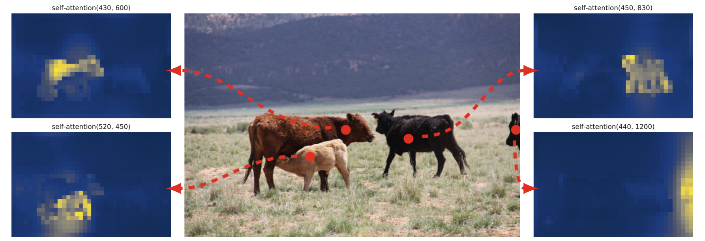

# [End-to-End Object Detection with Transformers](./HOI%20Detection入门精选/ECCV%202020%20-%20End-to-End%20Object%20Detection%20with%20Transformers.pdf)

## 基本思想

__本文提出了一种新的思路，将目标检测视为一个集合预测问题，这种方法简化了目标检测的流程，省去了手工设计的如NMS和先验框等操作。__

## Related work

#### bipartite matching losses（二分匹配损失）

#### set prediction（集合预测）
集合预测之所以叫做“集合预测”，是因为它涉及到对无序、可能大小可变的元素集合进行预测。

## 模型图
 

 __先使用CNN 得到各patch作为输入，再使用个Transform做编码和解码__

 __编码方式与VIT一致，在解码器部分，直接预测N个坐标框__

 
__这里encoder编码器获得K,V, 解码器获得Q。__

## attention 可视化结果
  

## 输出的匹配
&ensp;&ensp;&ensp;&ensp;举个例子: GT只有两个，但是预测的框恒为100个，怎么匹配呢？
&ensp;&ensp;&ensp;&ensp;使用匈牙利匹配,按照LOSS最小的组合，剩下的98个都是背景。

## DETR中的损失函数 & 匈牙利算法

#### 1. 分类损失
使用的是标准的交叉熵损失，用来衡量模型预测的类别分布与真实类别之间的差异。

对于每个预测的目标，DETR都会输出一个类别概率分布。分类损失的计算方式如下：

1. 对于每一个目标预测，DETR输出一个包含所有类别及一个特殊类别（表示没有目标）的概率分布。
2. 然后通过交叉熵损失计算模型的预测类别与真实类别之间的差异。

#### 交叉熵损失函数

对于单个样本，交叉熵损失函数的定义为：

$$
\mathcal{L}_{\text{CE}} = -\sum_{c=1}^{C} y_c \log(\hat{p}_c)
$$

其中：
- \( C \) 是类别的总数。
- \( y_c \) 是真实标签的一个one-hot向量，当样本属于类别\( c \)时，\( y_c = 1 \)，否则为0。
- \( \hat{p}_c \) 是模型对类别\( c \)预测的概率。

__示例__

假设一个分类问题中，有三个类别（\(C=3\)），且真实类别为第一个类别（\( y = [1, 0, 0] \)）。模型输出的概率分布为 \( \hat{p} = [0.7, 0.2, 0.1] \)。

则该样本的交叉熵损失为：

$$
\mathcal{L}_{\text{CE}} = -\left[ 1 \cdot \log(0.7) + 0 \cdot \log(0.2) + 0 \cdot \log(0.1) \right]
$$

简化后为：

$$
\mathcal{L}_{\text{CE}} = -\log(0.7)
$$

这种设计使得DETR在处理背景（无目标）的情况时非常有效，因为它可以显式地对“无目标”类进行建模。
#### 2. 边界框回归损失

边界框回归损失用于衡量预测的边界框与真实的边界框之间的差异。DETR使用的是一种称为L1损失和广义IoU（Generalized IoU, GIoU）损失的组合。

__1. L1损失：__ 直接计算预测边界框与真实边界框的坐标差异。这种损失衡量的是每个边界框的具体坐标偏差。

__定义__

假设对于每个目标，我们有预测的边界框坐标 \( \hat{b} = (\hat{x}_{\text{min}}, \hat{y}_{\text{min}}, \hat{x}_{\text{max}}, \hat{y}_{\text{max}}) \) 和真实的边界框坐标 \( b = (x_{\text{min}}, y_{\text{min}}, x_{\text{max}}, y_{\text{max}}) \)，则L1损失的定义为：

$$
\mathcal{L}_{\text{L1}} = \sum_{i \in \{x_{\text{min}}, y_{\text{min}}, x_{\text{max}}, y_{\text{max}}\}} |\hat{b}_i - b_i|
$$

其中：
- \( \hat{b}_i \) 是预测边界框的某个坐标值。
- \( b_i \) 是真实边界框的对应坐标值。

__示例__

如果预测的边界框为 \( \hat{b} = (0.6, 0.4, 0.9, 0.8) \) 而真实边界框为 \( b = (0.5, 0.5, 1.0, 0.9) \)，则L1损失的计算过程为：

$$
\mathcal{L}_{\text{L1}} = |0.6 - 0.5| + |0.4 - 0.5| + |0.9 - 1.0| + |0.8 - 0.9|
$$

最终结果为：

$$
\mathcal{L}_{\text{L1}} = 0.1 + 0.1 + 0.1 + 0.1 = 0.4
$$

__2. GIoU损失：__ 一种改进的IoU损失，用于解决标准IoU在重叠区域较小时的不足。GIoU不仅考虑两个框之间的交集，还考虑它们的包围盒之间的关系，从而在训练过程中提供更稳定的梯度。

__IoU的定义__

首先，IoU（Intersection over Union）的定义为：

$$
\text{IoU} = \frac{\text{Area of Intersection}}{\text{Area of Union}}
$$

其中：
- \(\text{Area of Intersection}\) 是预测边界框与真实边界框的交集区域的面积。
- \(\text{Area of Union}\) 是预测边界框和真实边界框的并集区域的面积。

__广义IoU的定义__

广义IoU通过引入两个框的最小闭包区域来改进IoU的不足。GIoU的定义为：

$$
\text{GIoU} = \text{IoU} - \frac{\text{Area of Minimum Enclosing Box} - \text{Area of Union}}{\text{Area of Minimum Enclosing Box}}
$$

其中：
- \(\text{Area of Minimum Enclosing Box}\) 是包围预测框和真实框的最小闭包区域的面积。

__广义IoU损失__

基于GIoU的定义，广义IoU损失函数可以定义为：

$$
\mathcal{L}_{\text{GIoU}} = 1 - \text{GIoU}
$$

__示例__

假设预测边界框和真实边界框的IoU为0.5，且最小闭包区域的面积为原来两者并集面积的2倍，则GIoU计算如下：

$$
\text{GIoU} = 0.5 - \frac{2 \times \text{Area of Union} - \text{Area of Union}}{2 \times \text{Area of Union}} = 0.5 - 0.5 = 0
$$

对应的广义IoU损失为：

$$
\mathcal{L}_{\text{GIoU}} = 1 - 0 = 1
$$

__此外,DERT采用匈牙利匹配算法来实现预测结果与真实标签之间的最优匹配，这在计算损失时至关重要。__

__示例__
假设模型输出了5个预测框，而真实框有4个。首先计算每对预测框和真实框之间的总损失，得到一个 
5 × 4的成本矩阵。应用匈牙利算法，找到一个最优的匹配，使得总损失最小。例如，匈牙利算法可能匹配如下：

预测框1 ↔ 真实框2
预测框2 ↔ 真实框1
预测框3 ↔ 真实框4
预测框4 ↔ 真实框3
预测框5 ↔ 无匹配（由于真实框少于预测框）

在这个匹配结果中，计算预测框和真实框之间的分类损失和边界框回归损失，得到模型的总损失。
