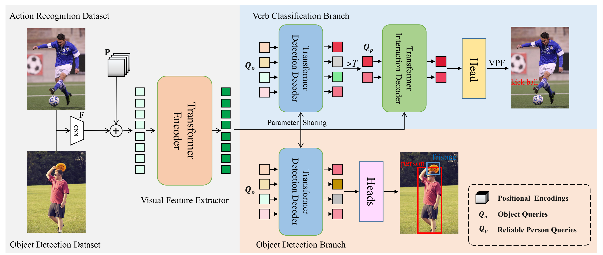
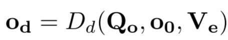
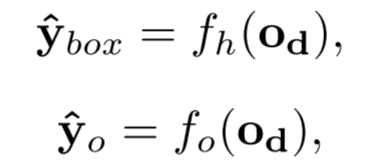
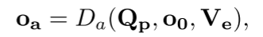
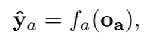
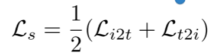
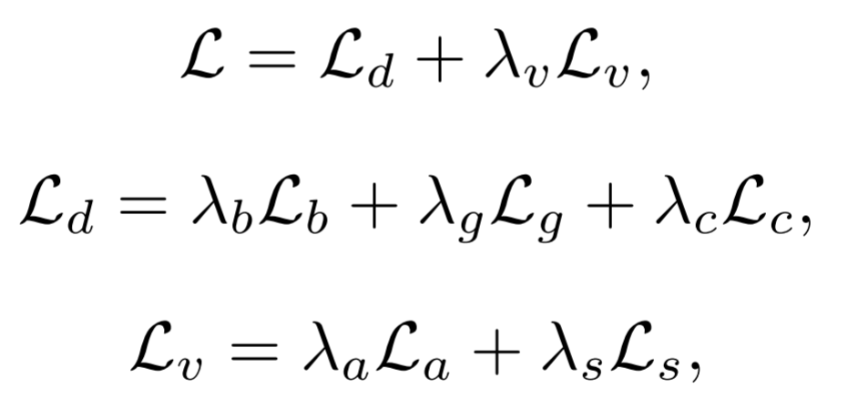

## Disentangled Pre-training for Human-Object Interaction Detection

最近的方法通过根据伪标签进行预训练来解决有效监督数据量不足的问题。伪标签将 ***Object regions*** 与 ***Image captions*** 解析的HOI三元组对齐。
- 但是伪标签噪声很大，使得HOI预训练成为了一个复杂的过程。

针对上述问题，本文提出一种 ***Disentangled pretraining*** 方法DP-HOI（HOI检测解缠预训练方法）：
- 首先，DP-HOI 利用对象检测和动作识别数据集分别预训练检测和交互解码器层。 然后，安排这些解码器层，使预训练架构与下游 HOI 检测任务保持一致。 这有利于有效的知识转移。
&nbsp;
具体来说，检测解码器识别每个动作识别数据集图像中的可靠人类实例，生成一个相应的查询，并将其输入交互解码器进行动词分类。 接下来，将人类实例动词预测结合在同一图像中，并施加图像级监督。

本文中，作者认为HOI检测可以分解为两个子任务：
***交互式人-物体对检测***   和    ***交互分类***
这两个任务与
***对象检测*** 和 ***动作识别***
两个任务密切相关，而这两个任务标记都比较容易，拥有大规模的数据集（比如：Objects365 和 Kinetics-700），而作者建议用这些标记数据集来预训练HOI检测模型。

因此引发新的一个问题，这些数据集是仅仅标记Object 以及 Action的，为了高效的知识转移，需要定制一个预训练架构来接近HOI检测任务。

### Method
#### Overview

提出的DP-HOI框架如图所示，在预训练期间，每个批次包含一组来自对象检测的图像 $D_d = \{X_i^d,y_i^d\}^{N_d}_{i=1}$ 和 另外一组来自动作识别数据集的图像$D_a = \{X_i^a,y_i^a\}^{N_a}_{i=1}$。$N_d$ 和 $N_a$ 表示图像的数量。 $y^d_i$包含对象边界框和对象类别， $y_i^a$ 仅包含动词类别。
将给定图像 $X_i^K$ 输入到CNN中，再送入Transformer编码器的自注意力操作得到增强。

由于 $y_i^d$ 和 $y_i^a$ 仅包含对象和动作标签，因此本文使用一种解开的方式利用增强 $X_i^d$ 和 $X_i^a$ 特征，一共有两个分支，一个检测分支和一个动词分类分支。

#### The Object Detection Branch
该分支包含一个检测解码器。 我们将 Transformer 编码器增强的特征表示为 $V_e$，将可学习对象查询表示为 $Q_o = \{Q_0, Q_1, ..., Q_{N−1}\}$，将初始解码器嵌入表示为 $o_0$。 输出解码器嵌入$o_d$可以表示如下：

其中$D_d(·)$表示检测解码器。 最后，使用 $o_d$ 来使用前馈网络 (FFN) 来预测对象边界框和类别：

#### The Verb Classification Branch
动词分类分支包含两个顺序解码器（即检测解码器和交互解码器）。 第一个解码器的输出嵌入被用作第二个解码器的查询。 检测解码器与目标检测分支中的解码器共享参数。 这两个解码器分别用于对象检测和动词分类。
*** Reliable Person Queries*** 可靠人查询。在本研究中，如果检测解码器的人类类别预测得分高于阈值 T，则人类实例被视为可靠。RPQ 是 od 中的解码器嵌入，用于预测交互解码器的这些可靠实例。 一幅图像的 RPQ 的集合表示为 $Q_p$。 每个 RPQ 使用交互解码器中特定人员的交叉注意力来搜索与动作相关的线索：

其中 Da(·) 表示交互解码器，oa 表示交互解码器的输出解码器嵌入。 最后，使用 oa 进行动词分类：

***Verb-wise Prediction Fusion***
尽管动作识别数据集通常不提供实例级动作注释，但单个图像可能包含多个人类实例。 因此，我们提出动词明智预测融合（VPF），通过沿其列维度进行最大池化来融合 $\hat{y}_a$ 中的预测结果。 在实验部分，我们证明了 VPF 优于其他融合策略，并有效抑制噪声 RPQ 预测。

#### Extension to Video and Caption Data
***Video Data*** 现有的动作识别数据集通常是基于视频的。 为了利用这些基于视频的数据集，我们从每个视频中随机采样 Nf 帧并将它们输入到我们的模型中以获得 RPQ 预测结果，用 $\{\hat{y}_a\}_{N_f}$ 表示。 然后，利用VPF方法来融合这些预测结果。 最后，采用焦点损失根据视频标签来监督融合结果。

***Image-Caption Dta*** 
由于动作识别数据集是根据固定的动作类别进行标记的，因此它们包含的动作语义是不够的。因此，利用了对比学习，从而能够使用具有强大动作语义信息的图像字幕数据进行预训练。 首先，我们使用基于规则的语言解析器来获取给定图像标题对的 HOI 三元组⟨人类、动词、对象⟩。 然后，将每个 HOItriplet 提示（即 {people} {verb} {object} 的照片）输入 CLIP 文本编码器以获得其嵌入。

在对比学习过程中选择负样本会显着影响模型性能。 在本文中，将所有 HOI-triplet 文本嵌入类别聚类为 100 个离线聚类。 然后我们从每个簇中采样 10 个 HOI 类别作为每个相应 RPQ 嵌入的负样本。 接下来，我们计算 RPQ 解码器和文本嵌入之间的余弦相似度，选择相似度得分最高的 RPQ。

最后，在两个方向上分别计算InfoNCE损失，以获得图像对齐损失$L_{i2t}$和文本对齐损失$L_{t2i}$。 这两个损失函数的平均值作为最终损失$L_s$：

#### Overall Loss Function
作者采用了与现有对象检测和动词分类研究类似的损失函数：

其中 $L_d$ 和 $L_v$ 分别表示对象检测和动词分类分支的损失函数。  $L_b$、$L_g$、$L_c$、$L_a$ 和 $L_s$ 表示损失，分别包括用于边界框回归的 L1 和 GIOU、用于对象分类的交叉熵、用于动词预测的 focus 和 InfoNCE 。 另外，$λ_v$是平衡两个分支损失的权重。

