## From Pixels to Graphs: Open-Vocabulary Scene Graph Generation with Vision-Language Models

使用视觉语言模型生成开放词汇场景图。本文是解决 ***SGG Scene Graph Generation*** 场景图生成任务。

现有的方法仍然难以生成具有新颖视觉关系概念的场景图。为了应对这个挑战，作者引入了一个具有序列生成的新的开放词汇SGG框架。具体而言，作者使用VLM通过图像到文本生成来生成场景图序列，然后从这些序列构建场景图。

***图像中的Scene graph***
如图所示：
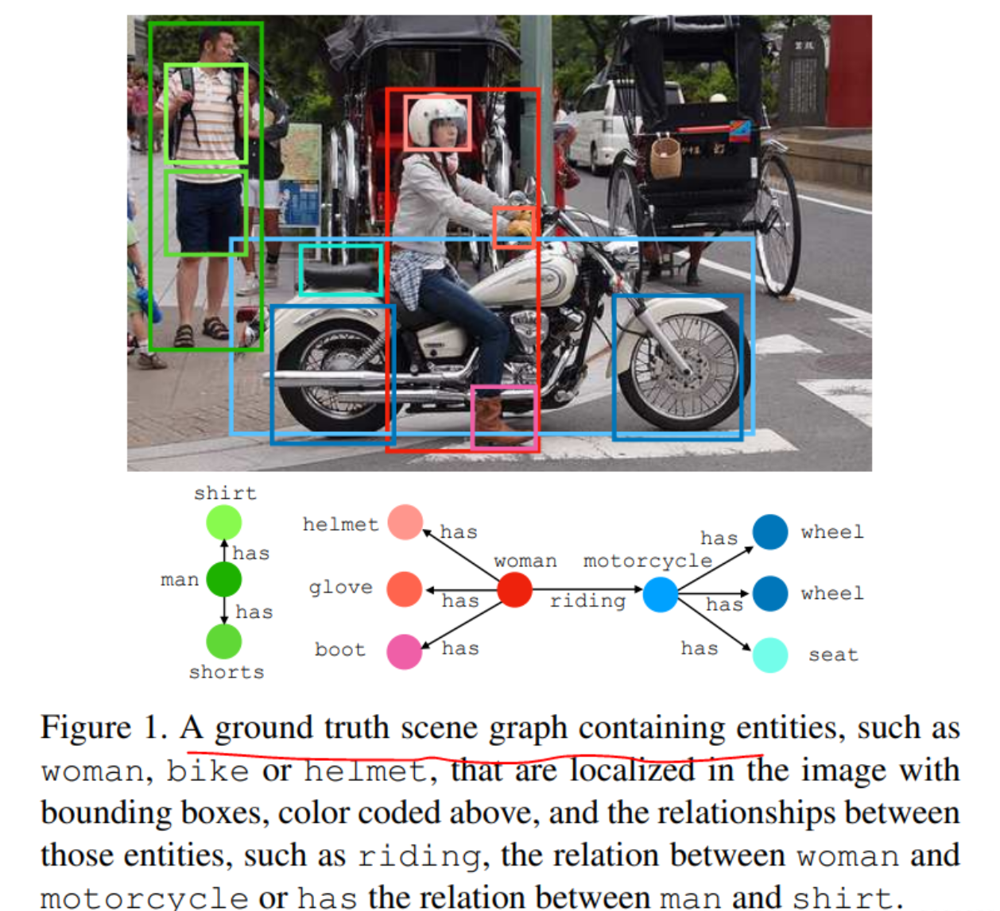
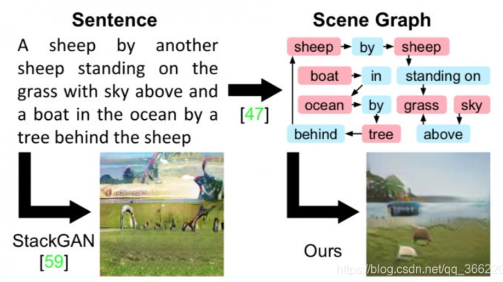

### ***任务背景***
SGG的主要目标是将图像解析为图表示，该图表示根据对象实体及其关系来描述视觉场景。这样生成的场景图可以作为视觉场景的结构和可解释的表示，促进视觉感知和推理之间的联系。 特别是，它已广泛应用于各种视觉语言（VL）任务，包括视觉问答，图像字幕，指代表达和图像检索。

以往的工作大多数集中在解决 close-world 设定下的SGG问题，但在 ***解决长尾数据偏差*** 和 ***标签不足*** 两方面问题仍然有明显不足。

~~过去的一些尝试通常侧重于开放词汇 SGG 任务的简化设置，例如仅允许新实体(OvSGG)，或 SGG 的子任务，例如使用给定实体对对开放集谓词进行分类，如上图的 A 部分所示。它仍然对在通用开放词汇设置中构建端到端 SGG 模型持开放态度。 此外，这些方法通常采用额外的预训练步骤来增强 VLM 在关系建模上的表示能力，这导致大规模模型的训练成本很高。~~
***(这里不知道什么意思)***

本文的目标是在更通用的环境中解决开放词汇SGG问题，即从像素生成具有已知和新颖 ***Known*** 和 ***Novel*** 的视觉关系三元组的场景图。

***贡献点***
- 我们提出了一个基于图像到文本生成VLM 的通用开放词汇SGG 问题的新颖框架，该框架可以与其他VL 任务无缝集成。 
- 我们的方法在生成VLM 之上引入了场景图提示和即插即用关系感知转换器模块，从而实现更高效的模型学习。
- 我们的框架在通用开放词汇SGG 基准上实现了卓越的性能，并在下游VL 任务上取得了一致的改进。

### 相关工作
#### ***Scene Graph Generation*** 
场景图生成（SGG）旨在对实体进行本地化和分类，并将它们在图像中的关系可视化。 最初，它被用作增强图像检索的辅助表示。 视觉关系的多样化语义概念和构成结构创造了巨大的概念空间，使得这项任务变得困难。 
研究人员从不同的角度研究了 SGG，包括解决内在的长尾数据偏差，结合场景上下文来建模不同的视觉概念，以及降低标签成本 通过弱监督或半监督训练。 然而，大多数 SGG 工作都集中在有限的类别上，而很少涉及 SGG 模型的泛化能力。 最近的研究，通过设计VL预训练模型来对未见过的对象类别的谓词进行分类，系统地研究了这个问题，并且有相关研究 研究了与未见的对象的视觉关系。 

#### ***Sene Graph for VL Tasks***
场景图已被广泛研究以改善视觉语言 (VL) 任务。 早期的作品使用场景图来改进图像检索。 多项研究表明，场景图可用于图像字幕、视觉问答 (VQA) 和视觉基础。 向下游任务的 VL 模型添加显式场景图很困难。
生成的场景图噪声可能会损害 VL 模型。 其次，与下游 VL 任务所需的视觉概念相比，在类较少的公共数据集上训练的 SGG 模型通常具有较大的语义域差距。 一些作品将场景图表示纳入模型训练中来解决这些问题。 我们的工作与这条路线一致：我们制定了一个统一的框架，允许显式场景图生成建模和 VL 任务之间的联合优化。

#### ***Open-vocabulary Scene Graph Generation***
开放词汇场景图生成以前的研究主要集中在增强视觉关系中新实体组合的泛化。最近通过视觉语言预训练解决了开放词汇谓词分类问题。 然而，这些方法很难有效地检测涉及现实世界场景中看不见的谓词的视觉关系。 
此外，最近的一些工作试图通过采用 CLIP 作为特征表示的教师模型来应对人与物体交互检测中看不见的动词的挑战。 然而，这些方法常常忽视探索开放词汇 SGG 和 VL 任务之间的协同作用。 在这项研究中，我们引入了一个利用 VLM 的统一框架来处理开放词汇 SGG 并增强 VLM 的推理能力。

### 先验知识
***Scene Graph Generation***
场景图生成的目标是从图像生成场景图 $G_sg = \{V_e,R\}$。其由视觉 $R = \{r_{ij}\}_{i≠j}$ 和 $N^v$ 实体 $V = \{V_i\}^{N^v}_{i=1}$。关系三元组$r_{ij} = (v_i,c^e_{ij},v_j)$表示第i个和第j个实体之间的关系，谓词类别表示$c^e_{ij}$，实体$v_i = \{c_i^v,b_i\}$ 由实体类别空间 $O^v$ 中的类别标签 $c^e_{ij}$和边界框 $b_i$ 组成，指示其在图像中的位置。谓词范畴$c^e_{ij}$ 属于空间$O^e$。

对于开放词汇谓词 SGG，谓词类别空间 $O_e$ 分为：已见基类 $O^e_b$ 和新未见类 $O^e_n$。 与之前的工作处理检测与未见过的开放词汇集的实体类别 $O_v$ 的关系，或对给定 GT 实体中的新颖谓词进行分类不同，我们探索了一种更现实且更具挑战性的设置，可以生成具有未见过的场景图 谓词概念。

***Vison-language Models***
在这项工作中，作者使用无检测器 BLIP并指令 BLIP 作为基础 VLM，它在许多 VL 任务上实现了最先进的性能。 它使用视觉编码器-文本解码器架构执行图像到序列生成任务。 

视觉编码器，表示为 $\mathcal{F}_{v\_enc}$，将输入图像 I 映射到视觉特征 $Z^v ∈ R^{M×d}$。 对于序列生成，具有标记预测器 $\mathcal{F}_{t\_dec}$ 的文本解码器通过自回归生成方法（例如波束搜索或 核采样。 token 序列 $t_s = [t_0, ..., t_T′ ] ∈ D^{T′}$，token classification score $P^s = [p_0, ..., p_{T′} ]R{T′×|Cvoc|}$ 在词汇空间 $C_{voc}$ 中。

### Method

#### Method Overview 
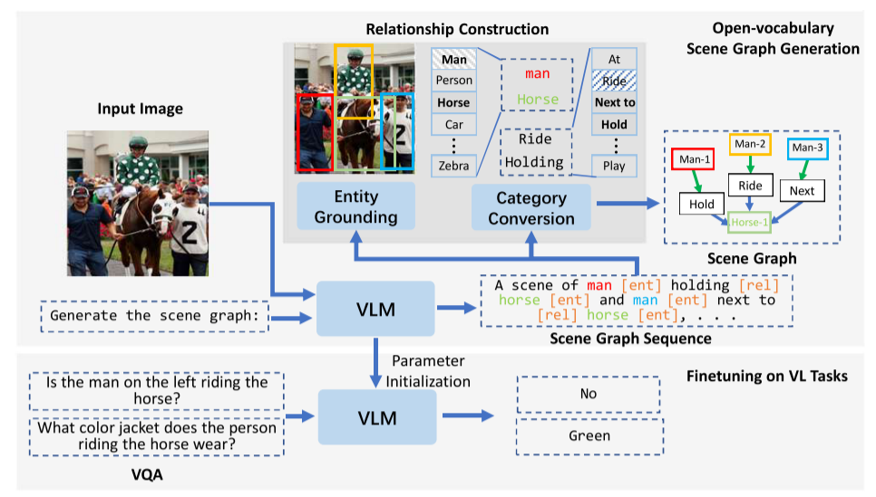
本文提出的 PGSG 框架将 open-vocabulary SGG 制定为图像到序列生成任务，这是通过具有参数 $θ_{sg}$ 的网络 $\mathcal{F}{sg}$ 来实现的。 此外，通过统一的表述，PGSG 框架可以将 $θ_{sg}$ 的显式场景图表示知识无缝转移到 VL 任务。

如图所示：我们的框架由三个组件组成：场景图序列生成***Scene graph sequence generation*** 、关系三元组构建 ***Relation trip construction*** 以及下游 VL 任务的适应***adaption to downstream VL*** 。
- 首先，我们通过 image-从输入图像 I 生成场景图序列 ssg 使用场景图序列提示生成 VLM 的文本。
- 其次，关系构建模块从场景图序列 ssg 中提取 R 来构建场景图 Gsg。
- 最后，我们使用 $θ_{sg}$ 调整 VLM，将显式场景图表示知识转移到 VL 任务。

#### Scene Graph Sequence Generation
场景图序列 $s_{sg}$ 由来自 $G_{sg}$ 的一组关系三元组 R 组成。 为了实现这一点，作者提出了场景图序列提示：
***"generate the scene graph of [triplet sequence] and [triplet sequence]..."***

它由两个主要组成部分组成：***the prefix instruction “Generate the scene graph of”*** 和 ***K relation triplet sequences***，用 "and" 或者 ","分隔。具体来说，每个三元组序列都是通过主语-谓语-宾语的自然语言语法从$r_{ij}$转换而来：
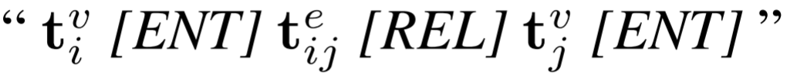
标记序列 $t^v_i , t^v_i 和 t^e_{ij} $表示主语、客体实体 $c^v_i ,c^v_j 和谓词 c^e_{ij}$ 的标记化类别名称。 我们还引入了指定的关系感知标记，[ENT]和[REL]，来表示关系的组成结构和实体的位置。

VLM的文本解码器以$Z^v$和前缀指令作为输入，生成$s_{sg}$。 此过程类似于标准图像字幕。 通过使用自然语言的词汇空间，我们可以使用广义语义表示来生成视觉关系。 以下模块提取空间和类别信息，并使用关系感知标记从序列构建实例感知关系三元组。

#### Relationship Construction
正如上述提到的，标准视觉关系三元组$r_{ij}$包含谓词类别标签$c^e_{ij}$，位置为$bi、bj$的实体以及类别$c^v_i 、c^v_j$。 关系构建的目的是从 $s_{sg}$ 中提取空间和类别标签来构建关系三元组。 
这种关系构建有两个子模块：
1）***Entity Grounding Module*** 实体基础模块，输出实体位置；
2）***Category Convert Module*** 类别转换模块，将语言预测从词汇空间转换为类别空间。

***Entity Grounding Module***
实体基础模块预测实体的边界框以基础场景图序列内生成的关系。 与输出包含坐标和单词混合的序列的现有多输出 VLM 不同，实体接地模块预测实体标记序列$“t^v_i[ENT]”、“t^v_j[ENT]”$来自 $s_{sg}$ 的 N 个关系三元组。
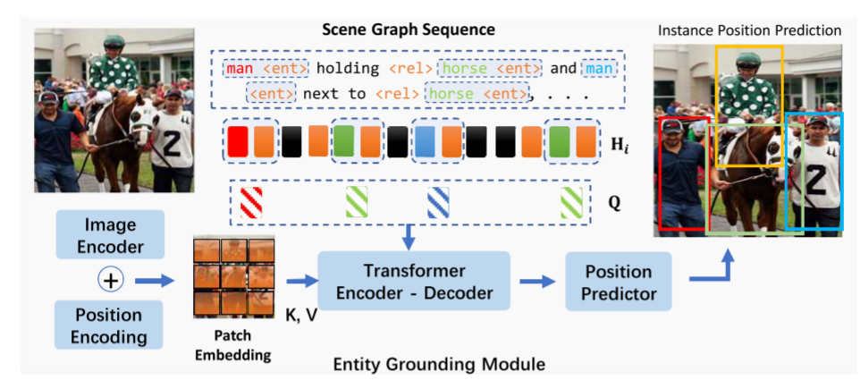

如上图所示，对于每个 token 序列$“t^v_i [ENT]”$，通过隐藏状态 $H_i = [h^{t^v_i} _1 , ..., h^{[ENT]}_{T_v} ] ∈ R^{T_v×d} $,提取 $b_i$，其中 $T_v$ 是 $t^v_i$ 的长度。 利用令牌隐藏状态作为查询 Q，通过注意力机制重新关注图像特征 $Z_v$，以更准确地定位对象。 
首先通过平均池化和线性投影将 $H_i = [h^{t^v_i} _1 , ..., h^{[ENT]}_{T_v} ]$ 转换为查询向量 $q^{ent}_i ∈ R^{d_q}$：
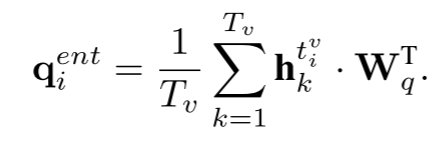
随后，使用 Transformer 编码器 $\mathcal{F}_{enc}(·) 和解码器 \mathcal{F}_{dec}(·)$ 通过 2N 个实体标记序列的查询之间的交叉注意力来解码 $b_i：Q = \{q^{ent}_1 , ..., q^{ent}_{2N}\} ∈ R^{2N×d} 和 Z_v$  。 最后，通过前馈网络FFN(·)预测B。
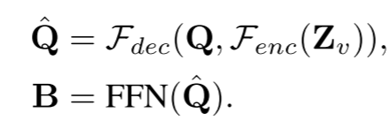
通过引入这个专用模块，能够从图像级场景图序列生成具有实例级空间预测的标准场景图。

#### Category Conversion Module
在序列生成期间，实体和谓词的类别由来自语言词汇空间 $C_{voc}$ 的标记表示。然而，SGG基准类别概念空间只是语言词汇的一部分。为了将开放词汇预测与目标 SGG 基准的类别空间对齐，需要将词汇标记转换为类别标签。 
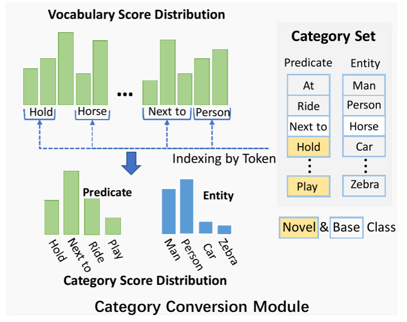
如图所示，类别转换模块将标记预测分数从词汇空间$C_{voc}$分别映射到目标SGG基准中的实体和谓词类别空间$O_v、O_e$。

类别转换模块是无参数的，它转换词汇得分 $P^s_i , P^s_{ij} ∈ R^T_v×|C_{voc}|$ 每个实体和谓词标记序列 $t^v_i$ 和 $t^e_{ij}$ 转化为分类预测分数 $p^v_i ∈ R^{|O_v|}$ 且 $p^e_{ij} ∈ R^{|Oe|}$ 分别。 为了实现这种转移，首先通过 VLM 的标记器将目标类别集标记化，包括实体 $O^v$ 和谓词 $O^e$ 到标记序列 $t^e_c$ 和 $t^v_c$ 中。
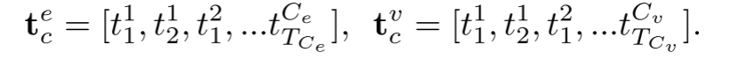
这里，上标 c 表示类别索引，T 是每个标记化类别名称的序列长度。 随后，我们使用 $t^v_c 和 t^e_c$ 的相应标记索引从 $p^s$ 组合$p^e_r$ 和 $p^v_i$：
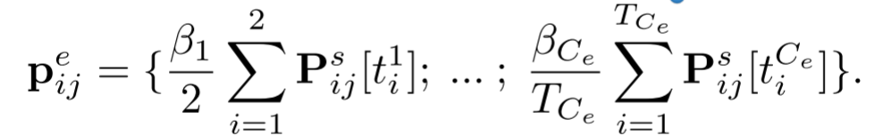

### Learning and Inference
对于 SGG 训练，使用由两部分组成的多任务损失：标准下一个令牌预测语言建模 $L^{lm}$ 的损失和实体基础模块 $L^{pos}$ 的损失。  $L^{lm}$ 损失遵循与 VLM 主干中相同的定义，这是标准的自回归语言建模损失。

它根据先前生成的标记 $(t = [t_1, t_2, ..., t_{i−1}])$ 和视觉特征 $Z^v$ 预测下一个标记 $t_i$。 该预测表示为：$t_i = \mathcal{F}_{vlm}(Z^v, t;θ_{sg})$。

为了训练这个 VLM，通过最大化正确预测长度为 K 的序列中每个后续标记的可能性来优化其参数 $(θ_{sg})$ :
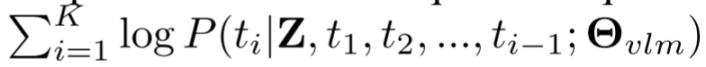

与之前的 SGG 方法相比，基于自回归的方法有效地捕获了谓词和实体之间的语义关系。 损失$L^{pos}$用于实体接地模块的边界框回归。 对于场景图序列的每个框预测 B，我们有 GIOU 和 L1 损失来计算距离 B 和 GT, $B_{gt}：L^{pos} = GIOU(B,B_{gt}) + ||B−B_{gt}||_1$。

### Adaptation to Downstream VL Task
