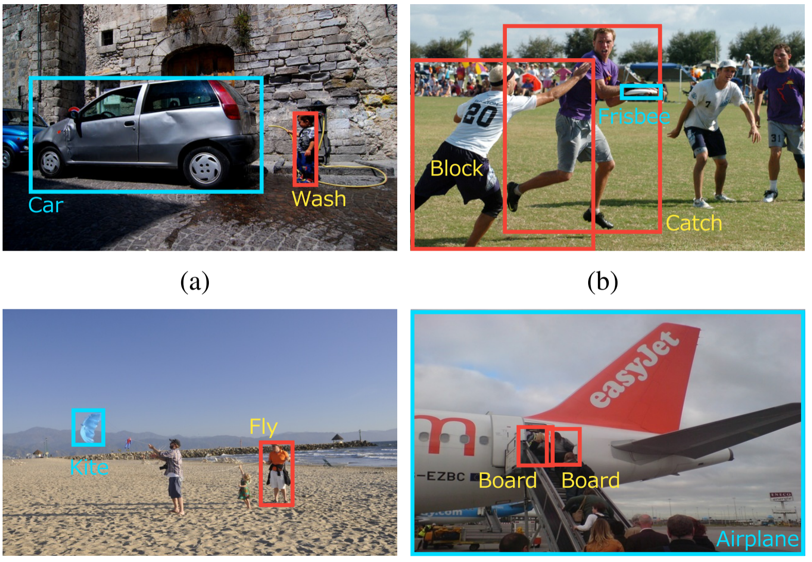
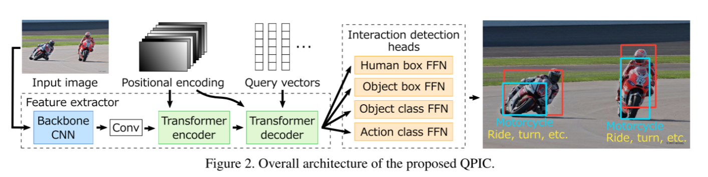
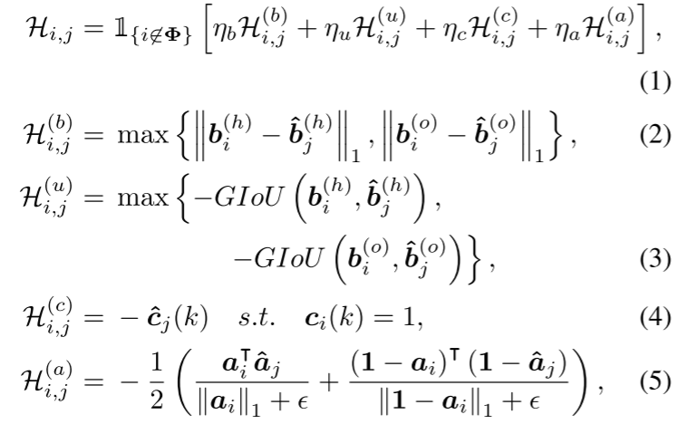
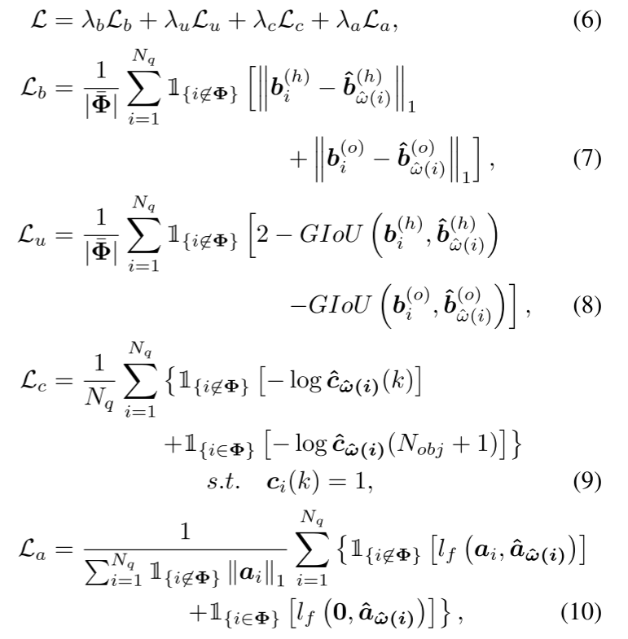

## [QPIC: Query-Based Pairwise Human-Object Interaction Detection with Image-Wide Contextual Information](/./HOI%20Detection入门精选/CVPR%202021%20-%20QPIC_Query-Based%20Pairwise%20Human-Object%20Interaction%20Detection%20with%20Image-Wide%20Contextual%20Information.pdf)

基于查询的图像范围上下文信息的成对人-物交互检测


__HOI__ : Human-Object interaction 人与物体交互。

所以HOI Detection和单纯的目标检测不一样，检测的任务是人和对象，并且识别他们之间的交互，如图：


___

### 以往的一些方法
__two-stage methods__ 两阶段方法：
人和物体首先由现成的物体检测器单独定位，然后使用定位区域的区域特征来预测动作类别。为了合并上下文信息，通常使用辅助特征，例如来自人和物体边界框的联合区域的特征以及图像中边界框的位置。

__困难__ ：通常只使用裁剪后的边界框区域（我理解的是仅仅关注框里面，所以会错过位于人和物体边界框之外的上下文重要信息。比如图a的软管)。

除此以外，对于图b，这种多个HOI实例重叠的示例，很容易得到污染的特征。

__single-stage method__
启发式定义的位置的特征（例如人类和物体中心之间的中点）来预测交互：
通过在特征提取的早起阶段将目标人和物体配对并提取 __集成特征__ 来捕获上下文信息，而不是单独处理目标。为了确定提取综合特征的区域，他们依赖于启发式设计的感兴趣位置，例如人类和物体中心之间的中点。

__困难__ ：图1c显示了目标人和物体距离较远的示例。 在此示例中，中点靠近中间的人，该人与目标 HOI 实例无关。 因此，根据中点周围的特征来检测目标是很困难的。 图1d是多个HOI实例的中点彼此接近的示例。 在这种情况下，基于 CNN 的方法往往会因为特征被污染而导致误检测。***我猜测：这里可能是因为CNN是局部注意力***

___

### 本文的方法QPIC
给予查询的HOI检测器，利用图像范围的上下文信息以成对的方式检测人和物体。QPIC由DETR扩展而来。

特点：设计的QPIC查询方式可以使得他们单独提取多个 HOI 实例的特征，即使实例位置很近，也不会污染它们。 我们通过使每个查询最多捕获一对人类-物体对来实现这一点。

QPIC整体框架与DETR基本一致，只有最后的检测头是针对HOI任务专门设计的。



___

##### 贡献点： 
第一个将基于注意力和查询的方法引入HOI检测的工作。

___

### 损失函数

__1. 二分匹配过程__
公式定义如下：

代码部分:
```python
"""outputs：模型的输出，包含以下内容：
'pred_obj_logits'：预测的物体分类的logits。
'pred_verb_logits'：预测的动作分类的logits。
'pred_sub_boxes'：预测的人的边界框。
'pred_obj_boxes'：预测的物体的（object）边界框。
"""

'''
targets：真实标签，包含以下内容：
'obj_labels'：真实的物体分类标签。
'verb_labels'：真实的动作分类标签。
'sub_boxes'：真实的人体边界框。
'obj_boxes'：真实的物体边界框。
'''

'''
假设batch_size:         2
查询数量num_queries:    5
物体类别数量cls_num:    3
动作类别数量:verb_num:  2
目标物体数量:obj_num:   4
'''
  @torch.no_grad()# 在计算过程中不会跟踪梯度，因此不会影响模型参数的更新。
  def forward(self, outputs, targets):
        bs, num_queries = outputs['pred_obj_logits'].shape[:2]
        # 提取批次大小和查询数量
        # bs = 2, num_queries = 5;

        out_obj_prob = outputs['pred_obj_logits'].flatten(0, 1).softmax(-1) 
        # (bs, query_num, cls_num) -> (bs*query_num, cls_num)将前两个维度展平为一个维度
        # (2, 5, 3) -> (10, 3)
        out_verb_prob = outputs['pred_verb_logits'].flatten(0, 1).sigmoid()
        # (2, 5, 2) -> (10, 2)
        out_sub_bbox = outputs['pred_sub_boxes'].flatten(0, 1)
        out_obj_bbox = outputs['pred_obj_boxes'].flatten(0, 1)  
        # (bs, query_num, 4) -> (bs*query_num, 4)
        # (2, 5, 4) -> (10, 4)
        # 展平并且计算概率
        # 对物体分类logits计算softmax概率。
        # 对关系分类logits计算sigmoid概率。
        # 将边界框展平（即批次和查询维度合并）。
        
        tgt_obj_labels = torch.cat([v['obj_labels'] for v in targets])      
        # (obj_num)
        tgt_verb_labels = torch.cat([v['verb_labels'] for v in targets])    
        # (obj_num, verb_num)
        tgt_verb_labels_permute = tgt_verb_labels.permute(1, 0)
        tgt_sub_boxes = torch.cat([v['sub_boxes'] for v in targets])
        tgt_obj_boxes = torch.cat([v['obj_boxes'] for v in targets]) 
        # (obj_num, 4) obj_num为当前batch输入里面所有物体的个数
        # 合并所有目标的物体标签、关系标签、人体边界框和物体边界框。
        '''
        tgt_obj_labels: [2, 2] → (4)
        tgt_verb_labels: [2, 2] → (4, 2)
        tgt_sub_boxes: [2, 2, 4] → (4, 4)
        tgt_obj_boxes: [2, 2, 4] → (4, 4)
        '''

        cost_obj_class = -out_obj_prob[:, tgt_obj_labels] 
        # (bs*query_num, obj_num)
        # 根据模型预测的物体分类概率与真实标签计算分类损失。

        tgt_verb_labels_permute = tgt_verb_labels.permute(1, 0)
        cost_verb_class = -(out_verb_prob.matmul(tgt_verb_labels_permute) / \
                            (tgt_verb_labels_permute.sum(dim=0, keepdim=True) + 1e-4) + \
                            (1 - out_verb_prob).matmul(1 - tgt_verb_labels_permute) / \
                            ((1 - tgt_verb_labels_permute).sum(dim=0, keepdim=True) + 1e-4)) / 2
        # 通过矩阵乘法和加权平均计算关系分类损失。
        '''out_verb_prob 的维度是 (10, 2)，tgt_verb_labels_permute 是 (2, 4)。
        第一次矩阵乘法后结果为 (10, 4)，同理第二次矩阵乘法后结果也为 (10, 4)。
        维度变化: (10, 2) → (10, 4)'''
        cost_sub_bbox = torch.cdist(out_sub_bbox, tgt_sub_boxes, p=1)    
        # (bs*query_num, obj_num)
        cost_obj_bbox = torch.cdist(out_obj_bbox, tgt_obj_boxes, p=1) * (tgt_obj_boxes != 0).any(dim=1).unsqueeze(0)
        # (tgt_obj_boxes != 0).any(dim=1).unsqueeze(0) (1, obj_num) 四个坐标点只要有一个不为0就计算bbox损失
        if cost_sub_bbox.shape[1] == 0:
            cost_bbox = cost_sub_bbox
        else:
            cost_bbox = torch.stack((cost_sub_bbox, cost_obj_bbox)).max(dim=0)[0]
        #使用torch.cdist计算预测边界框与目标边界框之间的L1距离（绝对差值），并对非零边界框进行加权。


        cost_sub_giou = -generalized_box_iou(box_cxcywh_to_xyxy(out_sub_bbox), box_cxcywh_to_xyxy(tgt_sub_boxes))
        cost_obj_giou = -generalized_box_iou(box_cxcywh_to_xyxy(out_obj_bbox), box_cxcywh_to_xyxy(tgt_obj_boxes)) + \
                        cost_sub_giou * (tgt_obj_boxes == 0).all(dim=1).unsqueeze(0)
        if cost_sub_giou.shape[1] == 0:
            cost_giou = cost_sub_giou
        else:
            cost_giou = torch.stack((cost_sub_giou, cost_obj_giou)).max(dim=0)[0]
        # 计算广义IOU损失


        C = self.cost_obj_class * cost_obj_class + self.cost_verb_class * cost_verb_class + \
            self.cost_bbox * cost_bbox + self.cost_giou * cost_giou
        C = C.view(bs, num_queries, -1).cpu() # (bs, query_num, obj_num)

        sizes = [len(v['obj_labels']) for v in targets]
        # [(bs, query_num, obj_num0), (bs, query_num, obj_num1), (bs, query_num, obj_num2) ...]
        # obj_num0 代表当前batch中第一张图片的物体个数，也即是三元组个数
        indices = [linear_sum_assignment(c[i]) for i, c in enumerate(C.split(sizes, -1))]
        return [(torch.as_tensor(i, dtype=torch.int64), torch.as_tensor(j, dtype=torch.int64)) for i, j in indices]
        # 使用匈牙利算法（linear_sum_assignment）基于成本矩阵进行匹配，并返回匹配结果。
```


__2. 损失函数部分__
对于非空三元组，检测框损失依然采用L1损失和GIOU损失，只不过这里是人体框和物体框损失加在一起，而物体类别则采用softmax损失，动作类别采用[focal loss](./HOI%20目标检测先验知识.md#FocalLoss)：


由于 decoder 一般由多层组成，可以把每一层的输出都拿出来接上最后的检测头预测一下，然后计算每一层的损失，平均之后作为最终的损失。

__Focal Loss__ 的引入主要是为了解决one-stage目标检测中正负样本数量极不平衡问题。

__那么什么是正负样本不平衡（Class Imbalance）呢？__

在一张图像中能够匹配到目标的候选框（正样本）个数一般只有十几个或几十个，而没有匹配到的候选框（负样本）则有10000~100000个。这么多的负样本不仅对训练网络起不到什么作用，反而会淹没掉少量但有助于训练的样本。

