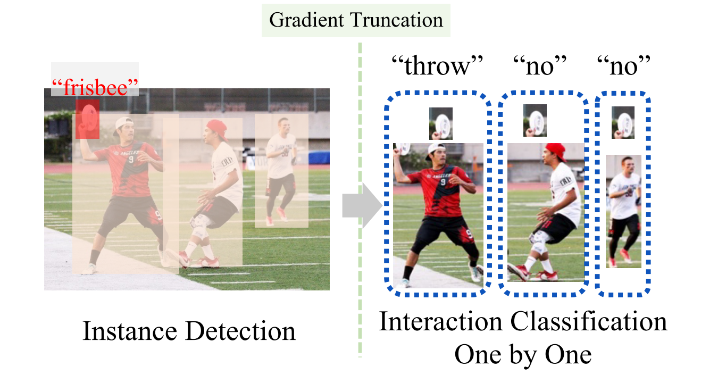
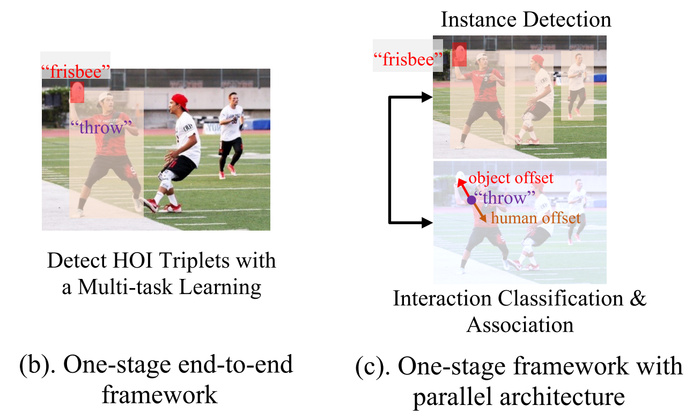
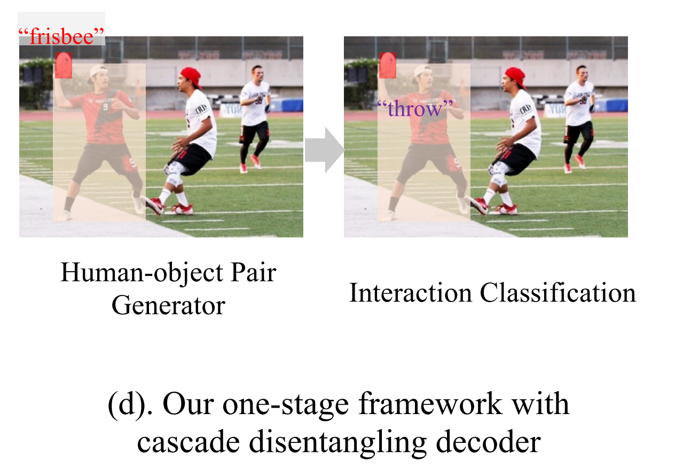
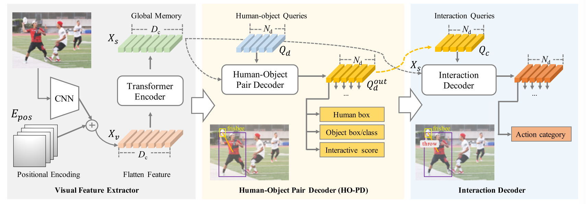
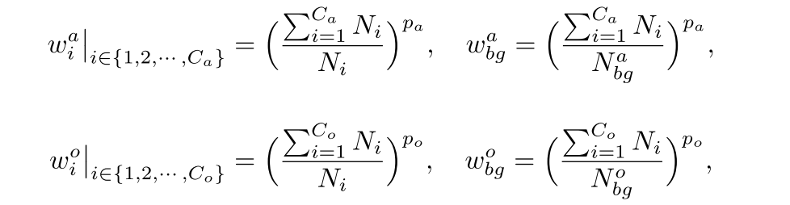

## [Mining the Benefits of Two-stage and One-stage HOI Detection](./HOI%20Detection入门精选/NIPS%202021%20-%20Mining%20the%20Benefits%20of%20Two-stage%20and%20One-stage%20HOI%20Detection.pdf)

本文的目标在于探讨HOI检测方法中两阶段法和一阶段法的本质利弊。

___

### 两阶段方法：
主要是定位正交互的人-物对

如图所示: 首先检测人和物体，然后通过人与物体的一一匹配生成的人-物体对输入到交互分类器中。也就是将$T(·)$分为检测 $T_d(·)$ 和 $T_c(·)$ 两个阶段。

具体而言，在第一阶段中 $T_d(·)$ 产生 $M$ 个Human bounding-boxes 以及 $N$ 个Object bounding-boxes。 因此总共产生了 $M × N$个Human - Object对。
接下来在第二阶段中 $T_c(·)$ 一一扫描所有Huamn - Object对，预测一个动作类别并且相应的置信度分数。
__由此导致的问题__：
1. 时间复杂度变为了 $O(M × N)$ 远远大于 $O(K)$。
2. 负样本过多，而导致模型对负样本的过拟合（所白了就是train歪了，模型宁愿对所有样本进行判负来减少受到的惩罚）
3. Two stage Detection并不是端到端的架构， $T_d(·)$ 由于关注对边界框的回归问题，因此其提取的特征更关注区域的边缘，提取的特征不一定适用于后续的Human - Object Interaction的分类任务。

__总结缺点__ ：
1. 在大量负对的干扰下仅根据局部区域特征来定位交互式人-物体对。
2. 效率也因串行架构得到限制

___

### 单阶段方法：
单阶段方法将HOI检测视作一个多任务学习

使用end to end的框架直接预测 HOI 的三元组。相比Two stage方法而言，时间复杂度降到了 $O(K)$ 。

One stage HOI detector中交互分支(Interaction branch)优化目标一般是 $\mathcal{P}(e^h, e^o, a|V)$ ， 其中$e_h$ 和$e_o$ 是associative embeddings(关联嵌入)。 总体的优化目标是$\mathcal{P}(b^h,b^o,a|V)$。

__缺点__ ：
1. 人体目标检测和交互分类是两个完全不同的任务，这要求模型关注不同的视觉特征，因此单个模型在多任务学习上很难做出很好的权衡。

___

### 本文提出的方法：Cascade Disentangling Network(CDN)
提出了一种新颖的一阶段框架，以级联的方式将人-目标检测和交互分类分开。
本文初衷: 保留传统单阶段方法的优点，直接准确地定位交互式人-物体对，并将两阶段方法的优点引入本文提出的的一阶段框架，将HOI检测和交互分类分解开。

首先通过去掉交互分类模块或头，并基于最先进的一阶段HOI检测器来设计一个human-object生成器（基于HOI-Trans 和QPIC 设计了HO-PD）。
然后设计一个相对独立的交互分类器来对每个人或物体对进行分类，为了链接Human - Object和相应的动作类，使用HO-PD最后一层的输出来初始化HOI解码器的查询嵌入。
本文提出的框架中的两个级联解码器可以专注于一项特定任务，即检测或交互分类。

__贡献__：
1. 对Two stage HOI detection 和 One stage HOI detection 进行了详细分析
2. 提出了一种带有级联解缠解(Cascade disentangling)码器的新型单阶段框架，以此同时结合两阶段和单阶段方法的优点。

#### 模型框架图

如图，首先通过 $\mathcal{P}(b^h, b^o|V)$ 预测Human - Object对，在使用isolated decoder 来预测动作类别 $\mathcal{P}(a|V, b^h,b^o)$。

___
#### Decoupling Dynamic Re-weighting （解耦动态重新加权）[^1]
HOI 数据集通常具有对象类和动作类的长尾类分布。为了缓解长尾问题，本文设计了一种动态重新加权机制，通过解耦训练策略进一步改进。 具体来说，本文首先用常规损失训练整个模型。 然后，冻结视觉特征提取器的参数，仅以相对较小的学习率和设计的动态重新加权损失来训练级联解缠解码器。

在解耦训练期间，在每次迭代时，应用两个相似的队列来累积每个对象类或动作类的数量。 队列用作存储体来累积训练样本并以长度 $L_Q$ 作为滑动窗口截断累积。 具体来说，长度为 $L_Q^o$ 的 $Q_o$ 为每个对象类别 $i ∈ \{1, 2, ··· , C_o\}$ 累积对象数量 $N_i^o$ ，长度为 $L^a_Q$ 的 $Q_a$ 为每个动作类别 $i ∈  \{1, 2,···,C_a\}$ 累积交互数量 $N^a_i$。 动态重加权系数$w_{dynamic}$如下：

[^1]:这里不是很懂
