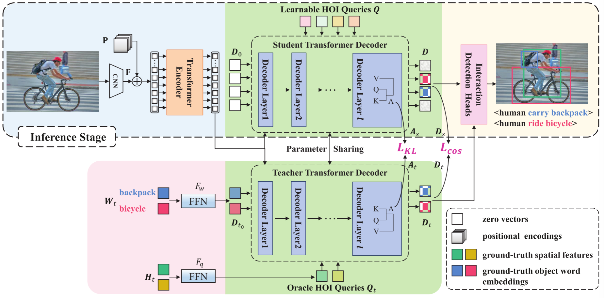
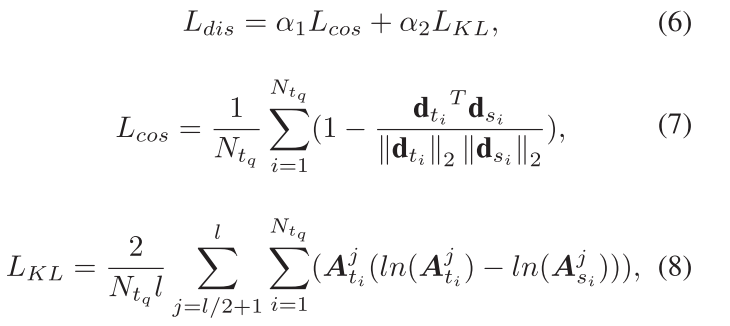
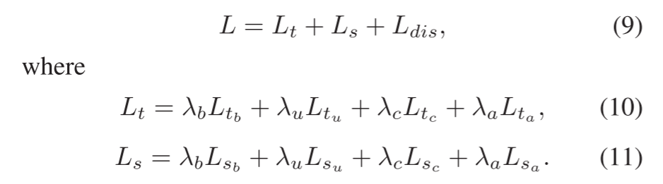
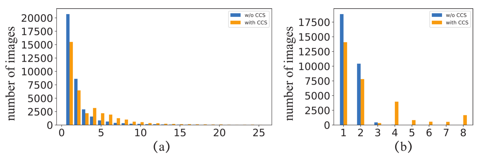
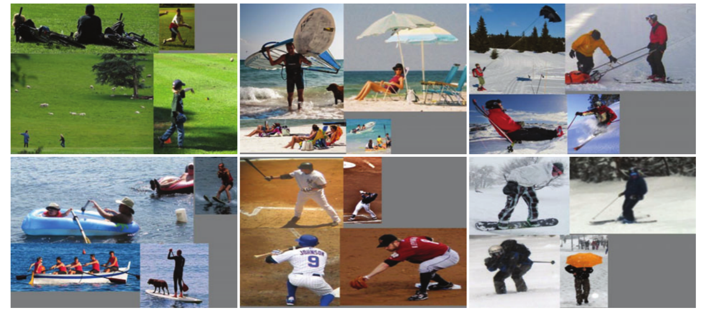

## [Distillation Using Oracle Queries for Transformer-based Human-Object Interaction Detection](./HOI%20Detection入门精选/CVPR%202022%20-%20Distillation%20Using%20Oracle%20Queries%20for%20Transformer-based%20Human-Object%20Interaction%20Detection.pdf)

### 过去的模型的主要面临的问题：
1. 往往采用语义模糊的查询，这降低了Transformer的表示学习能力：
   基于Transformer的HOI检测方法中每个查询仅仅包含一个可能的人体对象对的粗略位置，因此变压器解码器中的交叉注意力操作无法产生精确的注意力图。
2. 现有数据集中大多数图像的标记人体-物体对数量非常有限，限制了Transformer的集合预测能力。因此当出现具有许多人体-物体对的复杂图像时，Transformer可能会表现出性能下降。

针对第一个问题，本文提出了一种高效的知识蒸馏模型：__Distillation using Oracle Queries(DOQ)__。教师网络采用语义清晰的Oracle queries来生成高质量的decoder embeddings，通过模仿教师网络的注意力图和解码器嵌入，学生网络的表示学习能力得到显著提升。

例如 使用 QPIC 作为学生网络。教师网络和学生网络进行参数共享，两个网络之间的差异在于他们HOI查询和初始decoder embeddings。
- 对于学生网络，HOI查询和初始decoder embeddings分别定义为一组可学习embeddings和零向量。
- 对于教师网络，使用标记的Human-Object的真是位置构建一组oracle HOI查询。根据每个标记的人体-物体对中涉及的真是物体类别的word embedding 的精确语义和位置信息，来产生高质量的表征以及精确的注意力图。

针对第二个问题，本文引入了一种有效的数据增强方法：__Context-Consistent Sitiching(CCS)__ 上下文一致拼接。每一张新图像都是通过拼接从多个训练图像中裁剪出的标记的人体-物体对来获得。通过选择具有相似上下文的源图像，新的合成图像在视觉上逼真。

- 每个合成图像包含更多的Human - Object对，不需要手动标记。
- 创建的图像在视觉上逼真。
___

### 模型图

本文将解码器的操作定义如下:
$$
    D = f_{dec}(Q,D_0,E,P)
$$

其中 $f_{dec}$ 表示一组堆叠的Transformer解码器层。$ D_0 = \{d_{i0}|d_{i0} ∈ \pmb{R}^d\}_{i=1}^{N_q} $ 表示初始decoder embeddings。$ D = \{d_{i}|d_{i} ∈ \pmb{R}^d\}_{i=1}^{N_q} $ 表示最后一层decoder 的输出。接着 $D$ 被输入到FFN的交互检测头重来分别负责人体边界框定位、物体边界框定位以及物体分类和交互类别预测。

__因此 $D$ 的质量对于HOI检测至关重要。对于 $D = f_{dec}(Q,D_0,E,P)$ 来说，$D$ 尤其收到 $Q$ 和 $D_0$ 的影响。具体来说，$Q$ 对于所有图像都是相同的，而 $D_0$ 是一组零向量，这意味着它们在语义上都是不明确的。 这个问题限制了 $D$ 的表示能力并减慢了基于 DETR 的模型的收敛速度。__

因此，本文设计了一种知识蒸馏模型，教师网络采用 __Oracle Queries__ 以及 语义清晰的初始 __decoder enbeddings__ ，然后学生网络模仿教师网络的attention maps以及decoder embeddings来提高学生的学习能力。

#### Oracle HOI Queries
本文根据一对标记的Human - Object(HO)对的真实位置构建每个 Oracle HOI 查询。对于每个oracle query，教师网络中的交叉注意力会准确的关注到一对特定的HO。
用 $F_q$ 表示一个带有ReLU的两层FFN，tanh函数用来进行归一化操作。获得一个训练图像的Oracle HOI查询 $Q_t$ 集合操作如下：
$$
    \pmb{Q}_t = tanh(F_q(\pmb{H}_t)),
$$
其中 $\pmb{H}_t = \{\pmb{h_{t_i}|h_{t_i} ∈ \pmb{R}^{12}}\}^{N_{tq}}_{i=1}$
$$
    \pmb{h}_{t_i} = [x_{si},y_{si},w_{si},h_{si},x_{oi},y_{oi},w_{oi},h_{oi},x_{si}-x_{oi},y_{si}-y_{oi},w_{si}h_{si},w_{oi}h_{oi}]^T
$$
$N_{t_q}$表示图像标记的HO对数量，$H_t$表示一组空间特征，其中$h_{t_i}$的前8个元素分别是第i对人体和物体边界框的中心坐标、宽度和高度。$[x_{si} - x_{oi}, y_{s_i} - y{o_i}]$表示两个boxes之间的相对位置。最后两个元素表示两个boxes的面积。

#### Initial Decoder Embeddings 初始解码器嵌入
由于oracle HOI的查询仅包含box层次上的位置信息，这仍然很粗糙。接下来通过改进初始的Decoder embeddings进一步增强教师网络的功能。本文中参考真实的HO对中涉及的真实对象类别word embeddings生成初始Decoder embeddings $D_{t_0} = \{d_{t_{i_0}} | d_{t_{i_0}} ∈ \pmb{R}^d\}^{N_{tq}}_{i=1} $

$$
\pmb{D}_{t_0} = F_w(\pmb{W}_t)
$$

其中 $\pmb{W}_{t} = \{w_{t_{i}} | w_{t_{i}} ∈ \pmb{R}^{512}\}^{N_{tq}}_{i=1} $ 并且$w_{t_i}$ 表示第i个单词的word embeddings。 $F_w$ 表示带有ReLU激活函数的两层FFN。

__借助语义清晰的HOI query以及初始Decoder embeddings，教师网络可以成功生成精确的注意力图，从而输出高质量的解码器嵌入。__

### Distillation Loss 蒸馏损失
本文通过对齐教师和学生网络的 __Ouput Decoder embeddings__ 以及 __attention maps__ 来进行知识蒸馏。
- 首先建立 $D$ 与$D_t$ 之间的对应关系。
  
  其中 $\alpha1$ 和 $\alpha2$ 表示权重， $l$ 是解码器层数，文中设定为6。此外，$d_{t_i}$ 和 $d_{s_i}$ 分别表示 $D_t$ 与$D_s$ 的第i个embeddings。使用CosineEmbeddingLoss[余弦相似度损失函数](./HOI%20目标检测先验知识.md#余弦相似度损失)。
  $A_{t_i}^j$ 以及 $A_{s_i}^j$ 分别表示 $d_{t_i}$ 与 $d_{s_i}$ 的第j个解码器层找那个多头的averaged attention map。使用KL Divergence Loss[KL散度](./HOI%20目标检测先验知识.md#KL散度损失)损失来对齐 $A_{t_i}^j$ 以及 $A_{s_i}^j$，来约束学生网络生成与教师网络一样精确的注意力图。

### 总体损失函数

其中 $L_t$ 和 $L_s$ 分别表示教师网络和学生网络的损失函数。

### Contest-Consistent Stitching 上下文一致的拼接

如图所示，一幅图像中标记的HO对平均数量呈现长尾分布(某一类型数据会非常多)，即大量图像只包含少量标记的HO对。

因此本文提出了CCS(Contest-Consistent Stitching)。
- 具体来说，在训练阶段按照一定概率 $\gamma$ 将图像I替换为一个合成图像。选择图像替换时，首先从整个训练集中的K个最近邻中随机采样了三个图像（K个邻居是根据场景特征之间的距离离线确定的，场景特征是使用一种的现成场景分类模型提取，然后裁剪四幅图像[图像I以及他的三个邻居图像]中随机选择的一个标记HO对的联合区域）。如下图所示：

- 与以往用于分割或者检测的复制粘贴技术不同，以往的方法从一个图像中复制属于所选对象的所有像素，然后将其复制粘贴到另外一张图像上，他们没有考虑整个图像的上下文一致性，也不是为Transformer设计的，不一定会改变训练图像中的对象数量。