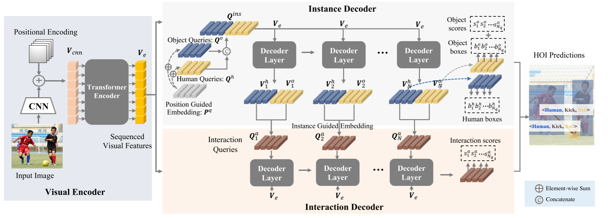
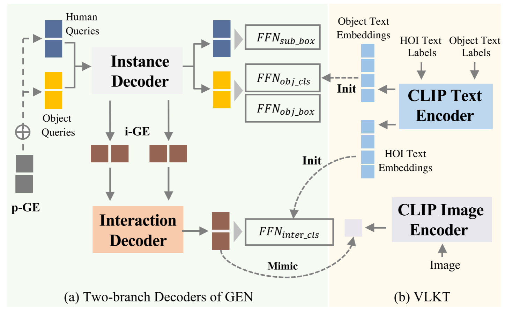

## [GEN-VLKT: Simplify Association and Enhance Interaction Understanding for HOI Detection](./HOI%20Detection入门精选/CVPR%202022%20-%20GEN-VLKT_%20Simplify%20Association%20and%20Enhance%20Interaction%20Understanding.pdf)

本文刷新了通用和 __零样本__ 双任务的 __SOTA__ 指标。
 
人与物体交互检测可以分为两个核心问题，即 __人与物体关联(Human-object association)__ 和 __交互理解(interacting understanding)__ 。本文总两个方面揭示并且解决了传统查询驱动的HOI检测器的缺点。
- 首先是对于association问题，以往的双分支方法存在复杂并且昂贵的 __post-matching(后匹配)__ 问题，单分支方法则忽略了不同任务中的特征区别。

本文提出了引导嵌入网络 __Guided-Embedding__（GEN）来实现无需后匹配的双分支网络。
- 在GEN中，作者设计了一个 __Instance decoder__（实例解码器）来检测人类与物体，使用两个独立的查询集和位置引导 __Position Guided Embedding__（p-GE）来将人类和物体标记为同一位置的一对。
- 此外，本文还设计了一个 __Interaction decoder__ 交互解码器来对交互进行分类,其中交互查询由每个实例解码器层的输出生成的实例引导嵌入 __Interaction queries__（i-GE）组成。
- 对于交互的理解，以前的方法往往存在 __long-tailed distribution__ （长尾分布） 以及 __zero-shot discovery__ （零样本发现）问题。本文提出了 __Visual-Linguistic Knowledge Transfer(VLKT)__（视觉语言知识迁移）训练策略，通过从视觉语言预训练模型CLIP迁移知识来增强交互理解。

### 以往的一些方法
HOI检测的核心问题是探索如何关联交互的人与物体，并且理解他们之间的交互。
- 对于 *association problem* (关联问题)，本文将以往的方法分为 *bottom-up* (自下而上) 和 *top-down* (自上而下)两种范式。
  - 自下而上方法：首先检测人和物体，然后通过分类器或者图模型将人和物体关联起来。
  - 自上而下方法：通常设计一个锚点来表示交互，然后通过预定义的关联规则找到相应的人和物体。
  - 基于查询的方法：可以分为双分支预测匹配方式以及单分支直接检测方式。
    - 双分支：预测交互，然后与 人、物 进行匹配，但是往往难以设计有效的匹配规则和复杂的后处理方法。
    - 单分支：提出基于具有多个头的单个查询以端到端的方式检测 人、物、交互。但是人、物检测与交互理解三个任务在特征表示上存在显著差异（检测主要关注其相应区域的特征，交互理解则关注人体姿势与上下文信息）。

    **本文基于对以往方法缺陷的总结，本文提出保留双分支架构，同时删除复杂的后匹配。**

- 对于 *interaction understanding problem* (交互理解问题)，大多数传统方法直接应用从数据集中拟合的多标签分类器来识别HOI。但由于真实场景中各种交互对象的复杂人类活动，直接使用数据集进行拟合往往受到受到长尾分布以及 __零样本(Zero shot)__ 影响。
  - 通过数据增强
  - 通过设计一些损失函数
    **CLIP建立了一个强大的视觉语言模型，在约4亿个图像文本对上进行训练。可以覆盖真实场景下绝大部分HOI场景。本文因此设计了一种视觉语言知识转移(VLKT)训练策略，将知识从CLIP转移到HOI检测器，来增强交互理解。**

### 模型图

如图所示，总体架构为编码器加上双分支解码器架构。首先采用配备有Transformer编码器架构得CNN作为视觉编码器来提取序列视觉特征 $V_e$ 。然后应用双分支解码器<实例解码器，交互解码器>来检测HOI三元组。
- 在Instance Decoder实例解码器中，基于 $V_e$ 分别通过Human query set $Q^h$ 以及 Object query set $Q^o$ 来检测Human 以及 Object。 在这里还设计了一个 **Position Guided Embedding(p-GE)** 位置引导嵌入来将人类和物体查询分配到同一位置作为一对。
- 在Interaction decoder交互解码器中，首先通过计算相应实例解码器中 Human 以及 Object queries的输出平均值来动态生成每个交互解码器层的交互查询 **Interaction queries** $Q_i^a$。因此交互解码器可以在人和物体查询的指导下预测相应的HOI类别。

#### 具体细节：
##### 视觉编码器
本文遵循基于查询的Transformer 检测器，为视觉编码器采用CNN-Transformer组合架构。先试用CNN提取低分辨率的特征图，再添加余弦位置嵌入，然后将特征输入到Transformer Encoder中。

##### 解码器
作者提出的模型双分支中的解码器共享相同的架构，采用基于查询的Transformer 解码器框架。
- Instance Decoder: 首先初始化两组查询 $Q^h$ 和 $Q^o$ 来检测人和物体，并且为两个查询集设计一个额外可学习的 **Position Guided Embedding(p-GE)** 位置引导嵌入 $P^q$ 。将 $P^q$ 添加到 $Q^h$ 和 $Q^o$ ，最后产生实例解码器的query set:
  $$
  Q^{ins} = [Q^h + P^q, Q^o + P^q]
  $$
使用 $Q^{ins}$ 送入实例解码器中预测 **Huamn bounding-box, Object bounding-box, Object category scores** 

- 提取每个解码器层解码的中间特征作为交互解码器的 $V^{ins} = [V^h, V^o]$。作者引入了一种用于关联的实例引导嵌入 **instance Guided Embedding(i-GE)** 方法。作者通过动态生成的 **I-GE** 来作为交互查询，来指导交互查询匹配人类和物体查询，而没有采用随机初始化的可学习embeddings：
  $$
  Q^a_k = (V^h + V^o) / 2
  $$

#### Visual-Linguistic knowledge Transfer
从大规模视觉语言预训练模型CLIP转移知识，即Visual-Linguistic Knowledge Transfer视觉语言知识转移(VLKT)

- **用于分类器初始化的文本嵌入**: 为了生成CLIP文本嵌入，首先将HOI三元组标签和对象标签转换为文本描述。
  例如：对于一个HOI三元组 <Human, Object, Verb>，按照 **"a pyhoto of a person [Verb-ing] a/an [Object]"** 的格式生成相应的描述；而对于没有交互的图像，则表示为： **"A photo of a person and a/an [Object]"**；对于对象标签，将其转换为短语： **"A Photo of a/an [Object]"**。
  然后通过预训练的CLIP text-encoder生成每个HOI和 object text label的 text embeddings $E^a$ 和 $E^o$ 。
  &nbsp;
  接着在这一类text embeddings的先验知识的指导下对交互和对象进行分类。通过这种方式，每一个输出查询特征都所有微调的text embeddings计算[余弦相似度](./HOI%20目标检测先验知识.md#余弦相似度损失)。并且在分类过程中返回相似度得分向量。
  &nbsp;
  以交互分类器 $C^a = [w_1^a, w_2^a,\dots,W^a_{N_a}]$ 为例，给定输出交互查询 $v_i^a$ ，计算相似度得分：
  $$
  S_i^a = \theta[sim(v_i^a,w_1^a), sim(v_i^a,w_2^a),\dots, sim(v_i^a, w^a_(N_a))]
  $$
  其中$sim$ 代表余弦相似度损失，$\theta$ 是CLIP中的Logit比例因子。同理，得到Object分类分数，此外，引用[focal loss](./HOI%20目标检测先验知识.md#FocalLoss)以及cross-entropy loss。

- **Visual Embedding Mimic**: CLIP通过在图像与文本对的数据上进行训练，将 **Visual embeddings** 和 **Text Embeddings** 对齐到相同的特征空间。本文设计了一种 **Visual embeddings** 模仿机制，通过拉进交互特征与CLIP **Visual embeddings** 之间的距离，将交互特征也拉入前面提到的特征空间中。这里使用 $\mathcal{L}_1$ 损失来拉进学生与教师之间的距离。使用 $N_q$ 表示查询数量，全局global的蒸馏损失 $\mathcal{L}_{glo}$ 定义如下:
$$
\mathcal{L}_{glo} = |\hat{V}_{clip} - \frac{1}{N_q}\sum_{i = 1}^{N_q} V_i^a|
$$

###损失函数
和大部分HOI检测损失函数一样，使用了匈牙利算法。总体损失由box regression loss 和intersection-over-union loss 以及 classification loss。
$$
\mathcal{L}_{cost} = \lambda_b \sum{i∈(h,o)}\mathcal{L_b^i} + \lambda_u \sum{j∈(h,o)}\mathcal{L_u^j}+\lambda_b \sum{k∈(o,a)}\lambda_c^k\mathcal{L_c^k}
$$
结合前面提到的蒸馏损失：
$$
\mathcal{L} = \mathcal{L}_{cost} + \lambda_{mimis}\mathcal{L}_{glo}
$$