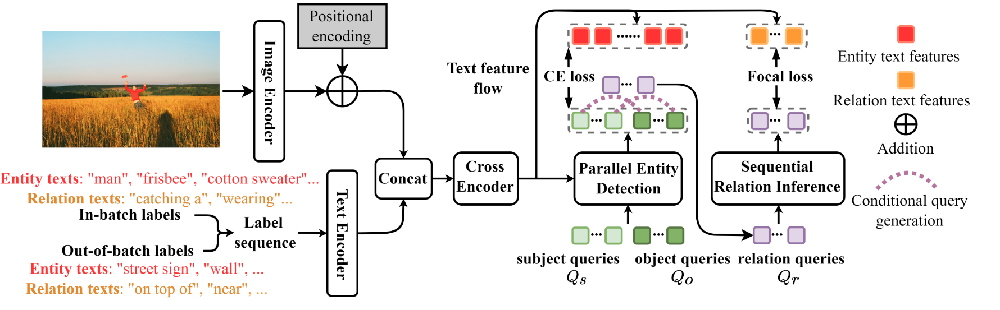

## [RLIP: Relational Language-Image Pre-training for Human-Object Interaction Detection](./HOI%20Detection入门精选/NIPS%202022%20-%20RLIP_%20Relational%20Language-Image%20Pre-training%20for%20Human-Object%20Interaction%20Detection.pdf)（看不太懂）

***目前HOI检测存在的一个关键挑战：在提供非详尽的培训数据，开发能够泛化到这些实体之间许多可能交互对的方法***

现有方法仍未充分探索针对该任务设计适当的 ***预训练策略***。因此本文提出了 ***Relational Language-Image Pre-training (RLIP)关系语言图像预训练模型***，利用实体**entity**和关系**relation**描述的对比预训练策略。

**贡献点**:
- 提出了一种新的并行 entity detection和 Sequential relation 推理(ParSe)架构。可以在整体优化的预训练期间使用实体和关系描述；
- 提出了一个合成数据生成框架，标签序列扩展，扩展了每个小批量中可用的语言数据的规模；
- 提出了一种考虑模糊性、关系质量标签和关系伪标签的机制，以减轻预训练数据中模糊/噪声样本的影响。

**本文在现有方法中实现RLIP遇到的困难：**
- 最近的端到端 HOI 检测架构通常采用主体、客体和关系三元组（的某些子集）的联合表示。 因此，很难利用现有数据集（例如 VG ）提供的对单独的人、物体和关系的文本描述。
- 对比预训练需要负样本才能有效训练，但先验不清楚如何构建这样的负样本。
- 自由格式的文本描述（***我理解的就是随便一句话***）表现出标签噪声和语义模糊性（因为在没有规范的类别列表的情况下可以有多种方法来描述相同的概念），渲染优化具有挑战性。

**针对上述问题，本文提出的解决方案** :
- 为了允许通过子集、对象和关系的不同描述进行端的到端对比预训练，本文提出了并行实体检测和顺序关系推理（ParSe）***Parallel entity detection and Sequential relation inference(ParSe)*** 架构。 
  ParSe 采用类似 DETR 的设计，为主题和客体表示分配单独的可学习查询组，以及一组对关系进行编码的附加条件查询。
  &nbsp;
- 本文通过使用批次外采样扩展批次内标签来合成标签序列，以确保充足的负样本供应——这里称之为标签序列扩展（LSE）***Label Sequence Extension(LSE)***。
  &nbsp;
- 本文利用跨模式线索来解决标签噪声和关系模糊性。 特别是，为了减轻标签噪声，我们使用视觉实体检测阶段的质量来为关系文本对应分配质量分数，我们将这种方法称为关系质量标签 **Relational Quality Labels**（RQL）。 为了减轻关系模糊性，我们利用标签之间的相似性通过伪标签方案传播关系，我们将其称为关系伪标签**Relational Pseudo-Labels**（RPL）。 

___
___

### Related Work
在 HOI detection 这一任务上，设计预训练来反映最终任务的目标还有待探索，以往往往采用 ***Object detection*** 预训练来初始化负责 ***entity detection*** 和 ***relation inference*** 的模型参数。但这种预训练对于 detection of relations between entities 可能不是最佳的，这通常要求模型考虑具有更大空间上下文的实体组，而不是孤立的单个实体。

### Method

#### Parse for Triplet Detection 用于三元组检测的Parse架构
***Structure overview*** 支持Parse架构得核心思想是在整体优化的模型中分配主体、客体和关系的不同表示（而不是像之前的工作中通常追求的那样表示它们的组合）。
- 不同的表示可以直接使用对比RLIP，因为这些表示可以与单独的实体和关系注释相对应。
- (ii) 职责分离允许对每个决策可用的上下文进行更细粒度的控制（别的论文已证明这一主题对于检测任务很重要）。特别要注意的是，在检测主题和对象时，***本地上下文***通常是最有用的。 然而，当涉及到关系时，检测不仅受益于信息丰富的***本地线索***，还受益于***邻近的上下文***（例如，在推断三元组 <人、洗涤、汽车> 中的关系时，了解水和软管很有用） ）。 为了实例化这个想法，我们遵循[69]并以两阶段端到端方式实现三元组检测。 我们的概率模型因式分解如下：

其中 $Q_s,Q_o ∈ R^{N_Q×D}$ 定义了 $N_Q$ 主题和 $N_Q$ 客体的两组独立查询；  C表示来自检测编码器的特征；  $B_s，B_o，R$分别表示检测到的主题框、对象框和关系的集合（它们共同构成检测结果G）；  $θ_{Par}$ 和 $θ_{Se}$分别表示来自实体检测解码器和关系推断解码器的可学习参数。 为了构建 ParSe，我们设计了两个组件：并行实体检测 ***parallel Entity Detection*** 和顺序关系推理 ***Sequential Relation Inference*** ，以实现等式 1中的第二项和第三项。

***parallel Entity Detection*** : 遵循 DETR 系列架构，我们首先使用图像编码器提取视觉特征，添加位置编码，然后根据我们采用的检测器将结果传递给定制的 Transformer 编码器以获得检测特征 $C$。然后，将两组查询 $Q_s$ 和 $Q_o$ 输入实体解码器以执行自注意力、交叉注意力和前馈网络（FFN）推理 ，获得 $\widetilde{Q}_s, \widetilde{Q}_o ∈ R^{N_Q} × D$ ，用于预测框位置和类别。

***Sequential Relation Inference***: 为了对关系进行编码，将顺序关系推理作为实体检测后的连续步骤执行（类似于CDN）。 ***在第一阶段***，通过并行实体检测来检测主体和对象。 ***在第二阶段***，我们在主体和客体之间采用简单的无参数匹配方案来生成关系查询：通过索引进行匹配。 使用这种配对方案，我们通过条件查询生成函数获得关系查询：
$$
Q_r = F_{so}(\widetilde{Q}_s, \widetilde{Q}_o)
$$
为了简单起见，这里采用加法作为查询生成函数。 由于这里通过索引进行匹配，因此 $Q_r ∈ R^{N_Q}×D$ 包含 $N_Q$ 关系查询。 然后将 $Q_r$ 送入第二个解码器，通过自注意力、交叉注意力和 FFN 推理进行顺序关系推理，得到对应的关系特征 $\widetilde{Q}_r ∈ R^{N_Q×D}$，然后用于关系分类

#### RLIP-ParSe for Relational Language-Image Pre-training
对于预训练的每一次迭代，构建一个小批量图像及其带注释的关系三元组，其中包括所有实体的位置、$N_E$ 唯一实体文本标签以及 $N_R$ 唯一关系文本标签。 如何将它们用于对比预训练过程如下：
***Formation of target label sequences*** 从批处理标签（Subject、Object、Relation三元组的自由格式文本描述）构建目标。 
具体来说，首先聚合批次内的所有实体标签，并将 ~~无对象标签~~ 附加到该序列。 
接下来，类似地聚合所有批内关系标签。 然后，所有实体和关系标签分别输入文本编码器（实现中为 [RoBERTa]），以提取分别表示为 $L_E$ 和 $L_R$ 的标签特征。 
注意，自由格式文本标签在标记化后可以有多个标记 - 我们仅使用从 [CLS] 标记派生的特征来表示标签。 最后将标签特征序列与图像编码器的特征连接起来，如模型图所示。
为了融合链接的特征，采用一种简单的方法：应用Transformer编码器来获得融合的标签特征 $\widetilde{L}_E∈R^{N_E×D}$ 和 $\widetilde{L}_R∈ R^{N_R×D}$

***Cross-model alignment through classification*** 通过分类进行夸模式对齐，为了实现RLIP，得要求模型使用分类目标在 ***entities/relations*** 以及他们的文本描述之间建立对应关系。本文中通过 Focal loss 将第 $i$ 个关系 $\widetilde{Q}_r(i)$ 与其文本关系进行对齐：

***Label Sequence Extension(LSE)*** 在给定批次内，给定批次内，可用于匹配的负样本数量是有限的。 然而，提供大量否定已被广泛证明可以改善对比学习。 为此，本文提出标签序列扩展作为利用批量文本描述的机制。 
具体来说，本文以三分之二实体标签和三分之一关系标签的比例对附加文本描述进行采样。 为了确保 Transformer 存在二次复杂度时的计算易处理性，本文将标签序列限制为预定义的长度 NL。 我们尝试了两种采样策略：（i）均匀采样，以相等的概率在候选标签中抽取； (ii) 基于频率的采样，根据训练集中的标签频率进行采样。

#### Addressing Relational Semantic Ambiguity(解决关系语义歧义)
数据集本身可能存在显著的标签噪声（描述不准确）和歧义，特别是当图像难以解释时。此外，由于同义词的存在，相似的 ***关系*** 可以用不同的方式描述：***例如："stand near"，"stand next to", "stand by"***。
为了缓解这些问题带来的影响，作者重点关注了预训练输入数据的两个方面：
- 关系本文标签的质量;
- 采样标签序列中存在语义相似的标签。

***Relational Quality Labels(RQL)*** 为了解决第一个问题，本文提出了标签平滑的方法：关键思想是，我们期望特定实例的主体和客体检测的难度与注释关系的置信度相关。 因此，我们建议根据实体检测阶段的质量来估计注释质量。 受到广义焦点损失的启发，我们通过评估二分匹配后第i个主体和物体检测的质量来实例化这个想法：

***Relational Pseudo-Labels(RPL)*** 为了解决第二个问题，本文提出一种伪标签策略来解释扩展序列的同义词。使得具有高语义相似性的文本嵌入靠的很近。将扩展序列中第i个带注释的关系标签和第j个关系文本特征之间的距离定义为：

#### Pre-training, Fine-tuning and Inference
预训练和微调阶段类似，对于给定批次的具有相同注释的图像，聚合并行实体检测和顺序关系推理的结果，来形成每一个图像的 $N_Q$ 三元组。和以前一样采用二分匹配，损失构成如下：

