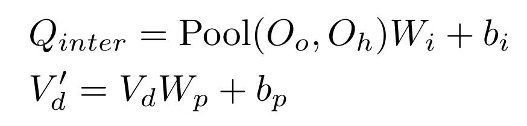
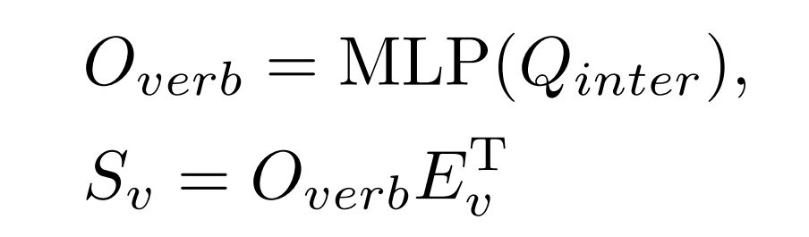

## [HOICLIP: Efficient Knowledge Transfer for HOI Detection with Vision-Language Models](./HOI%20Detection入门精选/CVPR%202023%20-%20HOICLIP_%20Efficient%20Knowledge%20Transfer%20for%20HOI%20Detection%20with%20Vision-Language%20Models.pdf)

对比语言-图像预训练在通过知识蒸馏为HOI检测器提供交互先验上表现出了巨大的潜力。但过去的一些方法依赖于大规模训练数据，并且在少量/零样本场景下性能较差。因此本文提出了一种新的HOI检测框架，可以有效的从CLIP中提取先验知识并且实现更好的泛化。
- 引入一种新的交互解码器，通过交叉注意力机制提取CLIP视觉特征图中的信息区域。然后通过 ***knowledge integration block*** 知识集成块将其与检测主干融合，来实现更准确的Human Object对检测。
- 利用CLIP文本编码器中的先验知识，通过嵌入HOI描述来生成分类器。为了区分细粒度的交互，本文通过视觉语义算法和 ***lightweight verb*** 轻量级动词表示适配器从训练数据构建 ***verb classifier*** 动词分类器。

由于对比视觉语言预训练其学习的视觉和语言表示在各种下游任务中表现得强大迁移能力，最近常用来探索解决 ***open-vocabulary*** 和 ***zero-shot learning problems***(开放词汇和零样本学习问题)。在HOI检测中包括GEN-VLKT和EoID，利用CLIP的知识来解决HOI任务重的长尾和零样本学习问题。但是目前仍然存在一些问题：
- 首先，普遍采用的师生蒸馏目标与提高学生模型的泛化能力不一致。
  
- 其次，学习HOI中的知识蒸馏通常需要大量的训练数据。
- 此外，知识蒸馏通常会在零样本泛化中遇到性能下降的问题，由于其缺乏对看不见类别的训练信号。

本文提出的解决方案：
- 直接从CLIP中检索学到的知识，而不是依赖蒸馏，并通过利用HOI识别的组合性质从多个方面（三个方面）挖掘先验知识。
  - 空间特征 ***Spatial feature***。特征位置是检测任务的关键，因此可以充分利用CLIP中的视觉表示并仅从信息丰富的图像区域中提取特征。本文开发了一种基于Transformer的交互解码器，可以学习具有跨模态注意力的局部交互特征。
  - 动词特征 ***Verb feature*** 。为了解决如[图 1] 所示的长尾动词类问题，本文开发了一个动词分类器，专注于学习更好的动词表示。 动词分类器由动词特征适配器和一组通过视觉语义算术计算的类权重 ***(a set of class weights computed via visual semantic arithmetic)*** 组成。 我们通过融合动词分类器和公共交互分类器的输出来增强 HOI 预测。
  - 语言特征  ***Linguistic feature***。为了应对 HOI 预测中非常罕见和看不见的类别，本文采用了基于提示的 HOI 语言表示，并为 HOI 分类构建了一个零样本分类器。 该分类器分支不需要训练，在模型推理期间将其输出与 HOI 分类器集成。
  &nbsp;
- 开发了一种基于 ***visual semantic arithmetic*** 视觉语义算法的动词类表示，来应对低数据条件下动词识别下的长尾和零样本学习。

### 相关工作
**Exploiting Vision-language Models**： 视觉语言模型VLM的一些工作证明了其在下游任务的迁移能力。从自然语言监督中学习到的视觉表示为零样本和开放词汇任务铺平了道路。 过去作品通过知识蒸馏将 VLM 转移到开放词汇对象检测 ***open vocabulary object detection***[^1], 目前也有迁移到HOI检测上的先例。这类的工作可以总结为：
- 通过文本整合先验知识，利用CLIP中标签的文本嵌入来初始化分类器。
- 特征（或logtis）级知识蒸馏，指导学习到的特征（或logit预测）与CLIP嵌入的图像特征（或零样本CLIP预测的logtis）对齐。

[^1]: 开放词汇物体检测（Open Vocabulary Object Detection, OVOD）是一种计算机视觉技术，它的目标是检测和识别不在训练数据集中明确出现过的物体类别。这种方法突破了传统物体检测模型只能检测预定义类别的限制，使得模型可以识别和检测更多未见过的物体类别。

**Zero-shot HOI Detection** ：零样本 HOI 检测的目标是检测和识别训练数据中缺少的 HOI 类别。 由于 HOI 的组合性，所有可能的 HOI 组合的注释是不切实际的[^2]。以往的一些工作以 **组合的方式** 解决了这样的挑战，在训练过程中解开了对动作和对象的推理，从而使得在推理过程中识别以往没见识过得<Human, Object, action> 成为可能。最近研究的重点是从VLM转移知识，来识别未见过的HOI组合。

[^2]: 比如说人和马可以有很多种动作组合：人骑马，人牵马，人给马喂草，人抚摸马等等...

### Method

#### 模型总体架构：

如图，给定输入图像 $I$，使用变换编码器获得空间图像特征图 $V_d$，然后使用**Instance Decoder**实例解码器和**Interaction Decoder**交互解码器分别完成实例检测和交互识别。与GEN-VLKT相似，**Instance Decoder**  将两组查询来分别作为 **Human** 和 **Object** 的输入，即 **Human query** $Q_h$ 与 **Object query** $Q_o$。

最后一个解码器层中的输出对象查询 $O_o ∈ R^{N_q × C_e}$ 和人类查询 $O_h ∈ R^{N_q × C_e}$ 用于预测人类边界框 $B_h ∈ R^{N_q × 4}$、对象边界框 $B_o ∈ R^{N_q × 4}$ 和对象类 $C_o ∈ R^{N_q × K_o}$ ，其中 $K_o$ 是对象类的数量。

给定人和物体特征，模型中引入一种交互解码器来执行交互识别，其中利用先前提取的特征图 $V_d$ 和 **CLIP** 生成的空间特征图 $V_s$ 中的信息，并通过 交叉注意力模块。 随后，***Verb Adapter***动词适配器提取动作信息以增强交互表示和识别。

#### Query Based Knowledge Retrieval(基于查询的知识检索)

**Zero-shot CLIP** ：CLIP 通过视觉编码器和文本编码器提取双模态特征。 视觉编码器由主干 $VisEnc(·)$ 和投影层 $Proj(·)$ 组成。
主干模块提取视觉空间特征 $V_s ∈ R^{H_s × W_s × C_s}$，然后送入投影层获得全局视觉特征 $V_g ∈ R^D$
文本编码器 $TextEnc(·)$ 为每个类别提取全局文本表示 $T_g ∈ R^{D × K}$，其中 $K$ 是类别数。 分类 $S ∈ R^K$ 计算如下：

其中$T_g$和$V_g$是$L2$归一化特征，$T_K$是描述$K$类别的句子。 矩阵乘法计算余弦相似度。

**Interaction Decoder with Knowledge Integration(具有知识集成的交互解码器)** ：为了预测一对人类和物体查询的HOI类别，本文提出的方法中通过将 **Human features** $O_h$ 和 **Object features** $O_o$ 送入一层Projection layer 生成了一组交互查询 ***Interaction queries*** $Q_{inter}∈R^{N_q × C_s}$。

为了充分利用CLIP的知识，这里在CLIP中检索交互特征 ***Interaction features*** 以更好的与分类器权重中的先验知识保持一致。具体来说，本文保留CLIP的空间特征 $V_s$ 并且将 $V_d$ 投影到与 $V_s$相同的维度。

其中 $W_i, b_i, W_p, b_p$ 表示projection的参数，$V'_d ∈ R^{H_s×W_s×C_s}$。

为了引导交互查询 $Q_{inter} ∈ R^{N_q×C_s}$ 探索 $V_s$ 和 $V_d$ 中的信息区域，如图设计了一个用于知识集成的交叉注意力模块，其架构如上图所示。$Q_{inter}$ 首先通过自注意力进行更新，然后馈送 分别进入具有 $V_s$ 和 $V'_d$ 的交叉注意力模块并获得两个输出特征。 最后，我们将所有输出相加并将其输入***Feed Forward Network***。数据流如下:

为了提取最终的交互表示$O_inter$，采用与CLIP想通的投影操作，将交叉注意力的输出转换到CLIP特征空间：
$$
O_{inter} = Proj(Q_{inter})
$$

总的来说，利用 ***Instance Decoder*** 中 Object 和 Human信息，从CLIP的空间特征图中检索交互表示，并且从检测器中检索视觉特征。

#### Verb Class Representation(动词类表示)

***Visual Semantic Arithmetic(视觉语义算法)*** 为了更好的从自然不平衡的HOI注释中捕获细粒度的 ***Verb relations*** ，本文通过视觉语义算法构建了一个全局的动词分类器。在这里作者假设 ***Verb class representation*** 可以从HOI的全局视觉特征与其对象的全局视觉特征的差异中得出。如上图所示 $<ride,surboard> - <surfboard> = <ride>$。

具体来说：使用元组 $(i,j)$ 来表示HOI类别，其中 $i$ 和 $j$ 来表示 ***Verb*** 和 ***Object*** 的类别。对于HOI和对象区域，本文使用CLIP图像编码器来获取它们的视觉特征，并且使用 ***projector*** 将特征映射，给定一个区域 $R$ 定义如下：

定义 $E_h^{k,j}$ 和 $E_h^j$ 分别表示HOI 以及Object 表示，动词类 K 的表示是通过其二者区域特征的差异来计算，如下:

***Verb Adapter*** 为了使用动词类表示进行分类，这里设计了一个轻量级适配器模块来基于交互特征 $O_{inter}$ 提取动词特征 $O{verb} ∈ R^{N_q × D}$ 。 具体来说，使用 MLP 将交互特征映射为动词特征 $O_{verb} ∈ R^{N_q × D}$，并计算动词类别分数如下：

其中 ***Verb logits*** $S_v$ 计算为动词特征 $O_{verb}$ 和动词类别表示 $E_v$ 之间的余弦相似度。 通过这种方式，我们利用 CLIP 视觉编码器中的先验知识从训练数据中提取动词分类器，并设计动词适配器以更好地表示动词。

#### Zero-shot HOI Enhancement(零样本HOI 增强)*
本文利用 CLIP 学习到的视觉语言对齐构建零样本 HOI 分类器，其中 CLIP 文本编码器 TextEnc 嵌入的标签描述用作分类器权重。这里和 ***GEN-VLKT*** 类似，将每个HOI类别转换为这样的句子: ***"A photo of a person [Ver-ing] a [Object]"***。 将这一类句子输入到CLIP的文本编码器TextEnc来获得 HOI 分类器 $E_{inter} ∈ R^{K_h × D}$, 其中 $K_h$表示HOI类别的数量。

为了利用零样本CLIP知识，作者根据图像的全局特征 $V_g$ 和 HOI 分类器 $E_{inter}$ 计算一组附加的 HOI logits。这里只保留了前K高的置信分数。

给定零样本 HOI 分类器 Einter，这里还使用它根据前面计算的交互表示 $O_{inter}$ 生成交互预测分数，

***ps：这里没搞懂为什么是乘法***

#### Inference and Training
- **Training**：在训练过程中，本文通过结合 HOI预测 $S_{inter}$ 和 动词预测 $S_v$ 来获得HOI logits。

- **Inference**： 前面提到的 Zero-shot HOI Enhancement 被用在推理过程中， HOI logits的获得方式为：

