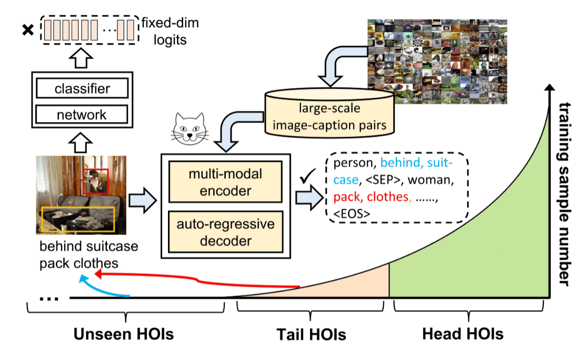
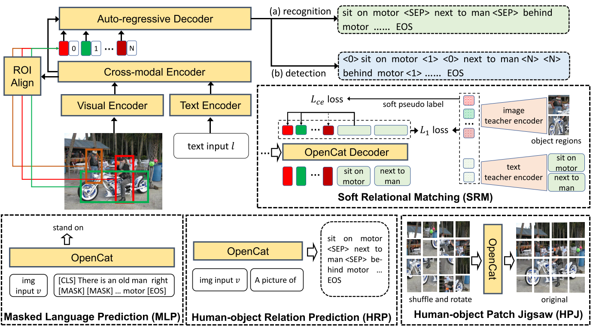
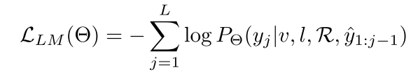
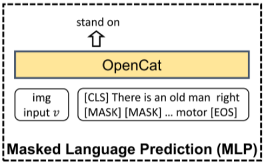
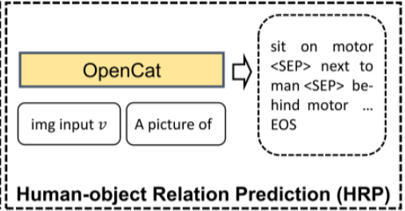
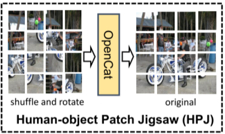
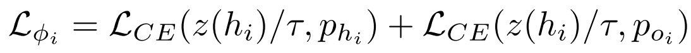

## [Open-Category Human-Object Interaction Pre-training via Language Modeling Framework](/OpenCat_Open-Category%20Human-Object%20Interaction%20Pre-training%20via%20Language%20Modeling%20Framework.md)

本文同样关注 HOI 检测任务中有限的监督数据与现实生活中大量可能交互组合之间的冲突 ***也就是其他论文提到的长尾分布和零样本问题***。
目前的方法主要是从 closed-set data 上训练，将 HOI 预测为固定维度的 ***Logits***，限制了模型对 open-set 类别的可扩展性。
- 为了解决这个问题，本文引入了 ***Opencat*** ，一种语言建模框架，将HOI预测重新表述为序列生成。通过序列化方案将 HOI 三元组转换为标记序列，我们的模型能够利用语言建模框架的开放集词汇来以高自由度预测新的交互类。
- 此外，受到视觉语言预训练巨大成功的启发，作者从图像-标题对中收集了大量与HOI相关的弱监督数据，并设计了一些辅助代理任​​务，包括软关系匹配和人-物体关系预测，来预训练模型。

***和以前的一些论文总结的不太一样，这里将 HOI 检测任务的输出总结为 <Human, Relation, Object>，以前是 <Huamn, Verb, Object>***
作者将HOI方法长期以来难以实现 ***"Open-category"*** 归结于 ***Inflexible prediction预测方式不灵活*** 和 ***Insufficient supervised data监督数据不足*** 两种原因。
- 以往的工作将HOI学习视为分类问题，其中类别词汇必须预先定义。这种方法涉及通过分类器将输入图像投影到固定维度的 logits 中，这限制了识别新 HOI 三元组的能力。
  - 与之相反的是，语言模型由于其广泛的标记词汇 ***Extensive token vocabulary*** ， 更适合预测自由格式的文本。
  - 因此本文将HOI学习重新表述为语言序列生成的问题，这使得模型能够利用 ***Open-set Vocabulary*** ，生成具有高自由度的 HOI 三元组。如下图所示：

OpenCat 将 HOI 学习重新表述为序列生成任务，而不是封闭集分类任务。 通过弱监督下特定任务预训练的帮助，我们的模型实现了对大量尾部和未见过的 HOI 类的开放类别预测。
&nbsp;
- 目前最流行的两个基准数据集 HICO-DET 和 V-COCO 分别包含了117个关系类，以及50个关系类，这仅仅只包含了现实场景中HOI类别的一小部分。
  - 收到一些方法的启发，想到可以使用预训练来克服 HOI 数据量不足的问题，但是利用弱监督或者无监督数据进行HOI预训练并不容易，必须精心设计预训练框架和代理任务。

___
### Method
#### 模型总览

模型总体架构遵循视觉语言 ***Encoder - Decoder*** 框架。
作者采用ResNet 101 和 RoBERTa 分别对 图像输入 $V$ 和 文本输入 $I$ 进行编码。并使用6层的Transformer Encoder 用于跨模态编码，紧跟着一个6层的Transformer 解码器用于 ***Token Sequence*** 的生成。

对于每一张图像，作者采用现成的 Object detector 来定位N个对象区域 $B = \{b_1, b_2, ..., b_N\}$ ，然后根据[ROI align](./HOI%20目标检测先验知识.md#ROIalgin)[^1] 从图像中裁剪并合并 $B$ 的 Region Embeddings $R$ 。接着与 ***Language modeling*** 方法相似，模型自动回归输出 HOI 三元组作为区域嵌入为条件的标记序列，并且一样使用最大似然目标进行优化：

其中 $y$ 和 $\hat{y}$ 分别表示目标序列与输入序列，$\theta$ 表示模型参数， $L$ 表示目标序列的长度。Region embeddings 在目标序列解码期间提供 box-level的先验信息。

[^1]: ROI Align 是一种用于目标检测和实例分割的操作，它的主要目的是从特征图中提取与图像中特定区域（ROI，Region of Interest）对应的固定尺寸的特征。

通过将 HOI 学习视为序列生成任务，我们的模型利用 VL 预训练方法的语义知识来生成人类和物体之间的关系短语 ***（例如，以“a man ? book°”为条件推断“read°”）***，此外，该模型还可以自由的预测新的 HOI 类别。

#### HOI Learning via Sequence Generation(通过序列生成进行 HOI 学习)
HOI 学习包含两个基本子任务：图像级 HOI 识别和实例级 HOI 检测。 前者涉及预测图像中的所有 HOI 类别，而后者旨在识别和 ***定位*** 所有 HOI 三元组，这使其比图像级 HOI 识别更具挑战性。OpenCat 将所有HOI学习任务重新表述为序列生成任务，具体操作如下：

***Image-level HOI Recognition***：模型识别图像中的所有 HOI 类别，并生成格式为 $[r_1, o_1, SEP, r_2, o_2, SEP, ..., EOS]$ 的目标序列。每个 $(r, o)$ 对代表一个 HOI 类别，特殊标记 $[SEP]$ 表示不同对之间的分隔，在预测厨[EOS] token 后，生成过程停止。作者在每一步对目标序列中图像的 HOI 三元组进行打乱，因为它们是无序的。 在推理过程中，作者提出模型直接预测所有三元组。 与将 HOI 分类为固定维度 logits 不同，本文的模型能够预测自由形式的 HOI 类别。

***Instance-level HOI Detection***：此任务的目的是检测图像中每个 HOI 实例 $(h, r, o)$的边界框，同时预测它们的类别。 然而，在多任务训练中，在人体目标检测和交互预测之间取得良好的平衡具有挑战性，因为这两项任务都很难完成。 

为了解决这个问题，本文采用了与当前单阶段 HOI 方法不同的方法，通过 离线对象检测***offline object detection*** 将两个任务从统一框架中解耦。 这种解耦还提供了额外的优势，因为可以利用新提出的检测器来获得更准确的对象位置和更好的视觉表示。

根据检测到的对象区域，模型将 HOI 实例检测为序列化标记。 具体来说，每个实例都表示为几个离散的标记，例如 $[p_h, p_o, r, o]$，其中 $p_h$ 和 $p_o$ 是 $[0,N−1]$ 之间的两个指针标记，表示人和物体已检测到的框边界的索引。
因此，HOI检测的目标序列可以表示为$[p_{h1}，p_{o1}，r_1，o_1，p_{h2}，p_{o2}，r_2，o_2，...，EOS]$。 $(p_{hi} , p_{oi} )$ 和 $(p_{hj} , p_{oj} )$，其中 $i ≠ j$ 可能指向相同的 (h, o) 对，因为人与物体之间的关系可以是多标签的。

#### 通过代理任务进行HOI预训练
为了进一步增强模型泛化能力，本文设计了几个辅助代理任务来辅助弱监督预训练。

***Masked Language prediction(MLP) 掩码语言预测*** 为了获得每个图像的HOI三元组，本文首先使用基于规则语言解析器 ***Rule-based language parser*** 来解析其相应的图像标题，并得到HOI三元组，表示为 $∅ = \{(h_1,r_1,o_1),(h_2,r_2,o_2), \dots\}$，用于MLP任务中。

然后随机从选择HOI三元组的子集，并且使用特殊标记 $[MASK]$ 屏蔽所选三元组的关系或者对象标记。掩码标记制定了目标序列 y。 此任务的目的是根据可用的视觉文本上下文来预测与 HOI 相关的屏蔽文本跨度。

***Human-object Relation Prediction (HRP) 人物关系预测(HRP)*** 在此任务中，向模型提供 ***图像*** 和 ***文本提示*** （例如，“a picture of”），并且需要使用自回归方式生成图像中所有可能的 HOI 类别。 预测序列的格式为[r1, o1, SEP, r2, o2, ..., EOS]。 为了增加生成序列的多样性，我们还通过随机打乱 HOI 类的顺序来增强目标序列。

***Human - Object Patch Jigsaw （HPJ）*** 从拼图游戏解决任务中汲取灵感，该任务有助于模型识别对象的关键部分，本文提出了人-对象拼图拼图（HPJ）任务。 给定一个图像描述对作为输入，我们将图像分割成 $H × W$ 的块，并从检测到的对象区域中随机选择一个人-对象对 $(h, o)$。假设人-物体对包含K个图像块，打乱这些块的顺序并将它们旋转角度 $k ∈ \{0°, 90°, 180°, 270°\}$，这意味着具有 $k$ 的旋转块需要 $360° - k$ 顺时针旋转恢复。

HPJ任务的目标序列可以表示为$[y^s_1, y^r_1, y^s_2, y^r_2, ..., y^s_K, y^r_K, EOS]$，其中$y^s_i ∈ [0,HW−1]$表示 第 i 个区域块在图像中的原始位置，$y_i^r ∈ \{0, 1, 2, 3\}$ 表示恢复角度类型。HPJ 任务使模型能够探索人与物体对中可区分的局部信息之间的相对关系，从而更好地理解它们之间的潜在交互。

***Soft Relational Matching 软关系匹配(SRM)*** 为了以弱监督方式学习人类和物体之间的对齐以进行 HOI 检测，这里提出了软关系匹配任务。 在此任务中，模型为每个图像输出一个标记序列，类似于第前面描述的实例级 HOI 检测范例。然而，由于指针标记 $p_h$、$p_o$ 的离散框索引不可用，本文通过从图像文本 ***教师编码器*** $\mathcal{V}$ 和 $\mathcal{T}$中提取知识来创建软伪标签，该编码器在数十亿个图像标题对上进行了预训练。 

具体来说，这里使用图像教师编码器 $\mathcal{V}$ 离线提取对象区域嵌入 $\mathcal{V(B)}$，并获得 HOI 三元组 $\phi$ 的文本嵌入 $\mathcal{T(\phi)}$。对于 $\phi$ 中的每个 $\phi_i = (h_i, r_i, o_i)$，将 $\phi_i$ 和对象区域 $\mathcal{B}$ 之间的软匹配标签计算为余弦相似度 $z(hi) = cos(\mathcal{V(B)}, \mathcal{T(h_i)})$ 和 $z(o_i) = cos(\mathcal{V(B),T(oi)})$。 然后应用 softmax 激活来计算交叉熵损失：

其中 $τ$ 是 scaling 温度。 将模型 θ 视为学生模型，并应用 L1 损失来最小化学生和教师输出嵌入之间的距离：$\mathcal{L}_1 = ||\mathcal{θ}(B), \mathcal{V}(B)||1 +||θ(\phi)  ,\mathcal{T}(\phi)||_1$。 使用$\mathcal{L}_{LM}$ 表示SRM任务的语言建模损失，则 SMR 的最终目标计算如下：
$$
\mathcal{L}_{srm} = \mathcal{L}_{LM} + \gamma_1\mathcal{L}_\phi + \gamma_2\mathcal{L_1}
$$

