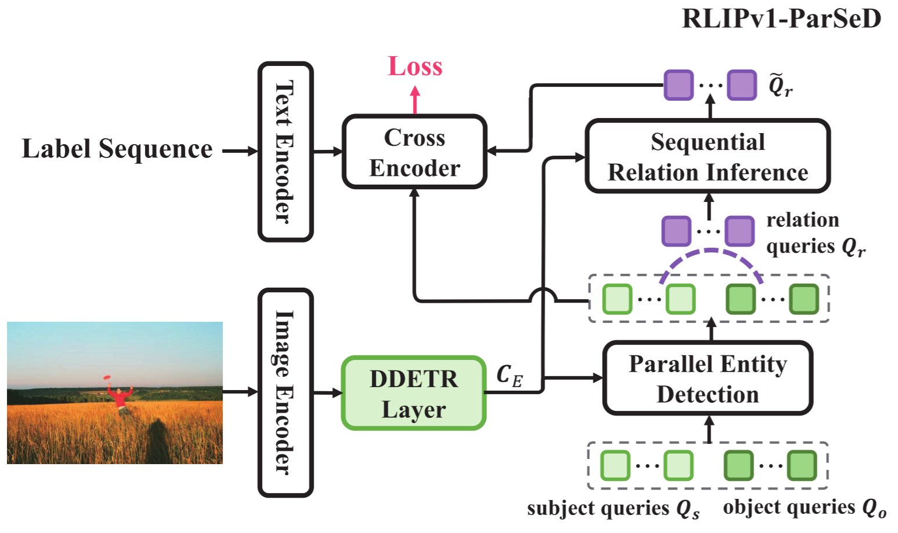
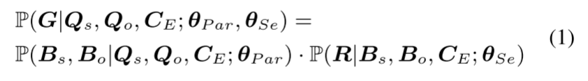
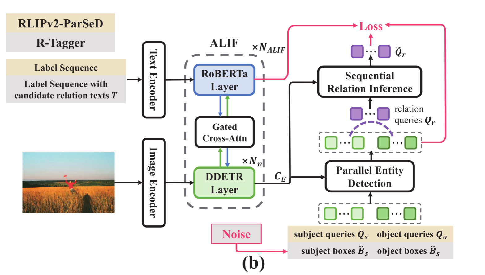
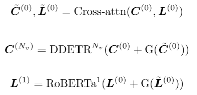
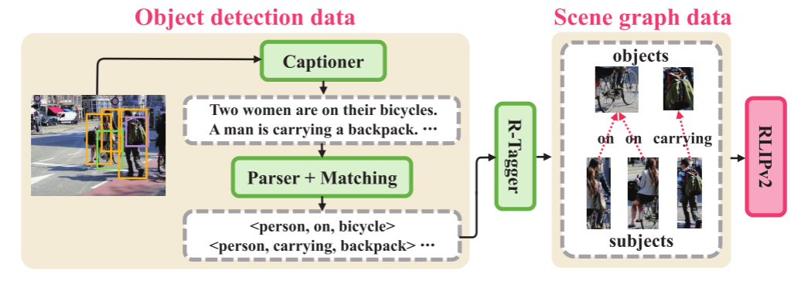
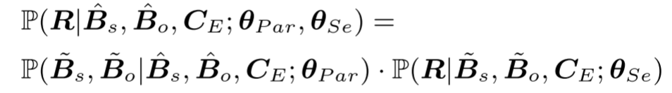
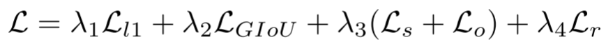

## RLIPv2: Fast Scaling of Relational Language-Image Pre-training

本文是基于RLIPv1的改进版，针对RLIPv1架构收敛速度缓慢以及现有场景图的可用性有限的问题提出的一种快速收敛模型，可以将 ***Relational pre-training*** 扩展到大规模伪标记场景图数据。针对了RLIPv1两个主要问题：
- RLIPv1 收敛缓慢。
- 带有关系三元组注释的数据很少。

为了实现快速扩展，PLIPv2引入了 ***Asymmetric Language-Image Fusion(ALIF)*** 非对称语言图像融合，这是一种 <u>促进与稀疏语言编码层进行更早、更深入的门控跨模态融合的机制</u>。

为了获得大规模场景图数据，作者通过引入 ***captioner*** 和 ***Designed Relation Tagger*** 来使用自由格式的关系标签扩展 ***Object detection***

实验结果在完全微调、少样本和零样本设置下的三个基准测试中均达到了SOTA。

### RLIPv1 回顾
RLIPv1利用 ***entity*** 和 ***Relation*** 的描述来执行VLP的模型。作为三元组检测的架构，RLIPv1提出了一种ParSeD模型，为主体、客体和关系分配解耦的embeddings。总的来说模型 RLIPv1-ParSeD分为三个阶段：
并行实体检测、顺序关系推理和跨模态融合（ ***parallel Entity Detection, Sequential Relation Inference and Cross-Modal Fusion*** )。如下图所示：

对于 ***Parallel entity Detection*** RLIPv1-parSe定义两组查询 $Q_s, Q_o∈ R^{N_Q×D}$，其中包含 $N_Q$ 对主体与客体。

对于 ***Sequential Relation Inference*** ，模型根据 Decoder 的subject 和 Object 查询 $\widetilde{Q}_s,\widetilde{Q}_o$∈ R^{N_Q×D}生成关系查询 $\widetilde{Q}_r∈ R^{N_Q×D}$来进行解码以用于关系识别。RLIPv1-ParSeQ的设计遵循以下概率分解：

其中 $C_E$ 表示来自DDETR编码器的特征， $\theta_{Par},\theta_{Sc}$ 表示 ***parllel Entity Detection*** 和 ***Sequential Relation Inference*** 的参数。$B_s,B_o,R$ 分别是检测到 Subject boxes, Object Boxes 和 Relations。

对于 ***Cross-Modal Fusion*** ，RLIPv1-ParSeD附加了额外的Transformer编码层，以在解码的Relation features $\widetilde{Q}_r$ 和entity label features $L_E$以及Relation label features$L_R$ 上执行语言-图像特征融合。

## Method

### ***Asymmetric Language-Image Fusion***
支撑 ALIF 的核心思想是在 RLIPv2 的早期阶段执行高效的跨模态融合。 与 RLIPv1 鼓励解码阶段后实体和关系的跨模式对齐不同，ALIF 在检测编码阶段执行此操作。 这对于 DDETR 的编码器来说尤其具有挑战性，因为它依赖于可变形的注意力，这使得在检测编码阶段采用专用编码器层具有挑战性。

为了解决这个问题，本文提出了 ALIF，这是一种利用视觉分支的 DDETR 编码、语言分支的 RoBERTa 编码和 ***门控交叉注意力 Gated cross-attention*** 进行融合的机制。 与之前使用相同层数对图像和语言进行编码的工作相比，作者通过实验发现过多的 RoBERTa 层并不能提高其泛化能力，因为它可能会过度拟合预训练数据 。

此外，由于模型复杂性增加，这种范式导致训练困难。 因此，我们密集地执行 DDETR 编码，而稀疏地执行 RoBERTa 编码。 我们将主干网的视觉特征表示为 $C(0)$，将 RoBERTa 的语言特征表示为 $L(0)$（$L_E$ 和 $L_R$ 的串联）。 第一个 ALIF 模块可以表述为：

其中 $\widetilde{C}^{(0)}, \widetilde{{L}}^{(0)}$ 表示通过交叉注意力聚合的特征，$N_v$表示ALIF中DDETR层的数量；$G(x)$定义了一个门函数，用于门控聚合的扩模态特征。

### ***Relation Pseudo-labelling***

***Relation Candidate Set Generation***
对于给定图像，关系候选集生成旨在生成候选主客体（SO）区域对 P 及其候选关系文本 T 的粗粒度集合。
- 首先，采用 BLIP 为每个图像生成 $N_{Cap}$ 标题。 请注意，当 $N_{Cap} = 1$ 时，通过 ***beam search*** 波束搜索（一种确定性生成方法）生成标题； 当 $N_{Cap} > 1$ 时，我们通过 ***nucleus sampling*** 核采样生成字幕(这是一种累积概率阈值设置为 0.9 的随机生成方法)。 核心采样为生成的标题添加了语义多样性，这有助于关系的多样性。
- 其次，采用场景图解析器将获得的标题解析为关系三元组。 为了过滤掉无效的解析三元组，在执行字符串匹配并保留那些主语和宾语可以与图像中任何实体名称或实体同义词匹配的主语和宾语。 该操作包含一小组可能的 SO 区域对 P 和这些对的可能关系文本 T（它们是 R-Tagger 的输入），而不需要遍历所有可能的对。

***Relation Tagger via RLIPv2 Architecture***
和RLIPv1，RLIPv2一样利用主体查询$Q_s$和客体查询$Q_o$作为输入。为了允许使用对象注释作为输入，我们建议用对象嵌入替换检测查询 $Q_s$ 和 $Q_o$，其目的是鼓励并行实体检测来重建对象表示和顺序关系推理来识别关系。 与之前的等式相比，推理过程中 R-Tagger 的概率因式分解可以重新表述为：

***Denoising Training of R-Tagger***

R-Tagger 的训练损失与 RLIPv1 相同。