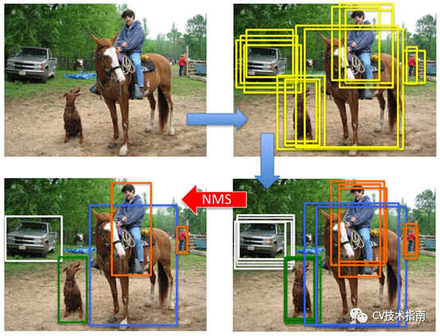
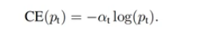
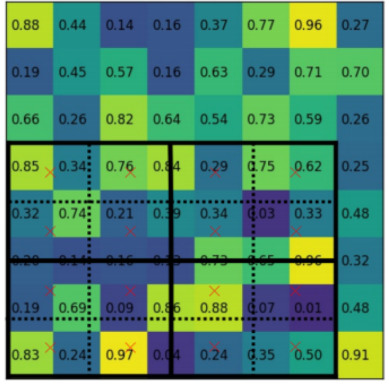

# HOI目标检测的一些先验知识

## 最经典的一些目标检测算法
__faster-rcnn系列，开山之作__
__YOLO系列__
  
## IOU
IOU是一种测量在特定数据集中监测相应物体准确度的一个标准。
对于两个区域，IOU计算如下：


## 锚框(anchor box) 与 先验框(prior bounding box)
anchor box 与 prior box 其实是一个意思。
__1. 锚框的作用__
对于目标检测任务，有这样一种经典解决方案：遍历输入图像上所有可能的像素框，然后选出正确的目标框，并对位置和大小进行调整就可以完成目标检测任务。这些进行预测的像素框就叫 __锚框__ 。这些锚框通常都是方形的,并且为了增加任务成功的几率，通常会在同一位置设置不同宽高比的锚框。


__2. 特征图中的锚框__
如果按照上述方案不加改变的执行，即使是一张图片所产生的锚框将多到我们难以承受的地步。对于一个224x224的图片，假设每个位置设置3个不同尺寸的先验框，那么就有224x224x3=150528个锚框；这个数量太大了！所以，更好的处理方式是先对原图进行下采样处理，得到feature map，在feature map中生成锚框。以vgg16的backbone为例，把224x224的输入图片下采样了5次，得到7x7的feature map，那就只需要得到7x7x3=147个先验锚框，这样的设置大大减少了先验框的数量，同时也能覆盖大多数情况。

__3. 先验框与IOU__
在训练任务阶段，可以在输入图片中插入正确的目标框，以供网络学习ground truth信息。而判断一个锚框是否与目标框相近的指标，很自然的可以选择锚框和目标框的IOU（交并比）。 例如，可以设定一个阈值0.5，如果iou<0.5的先验框，这些框我们将其划分为背景，设为背景框，Iou>=0.5的被归到目标先验框。


## NMS（Non-Maximum Suppression）非极大值抑制
NMS（Non-Maximum Suppression）__非极大值抑制__（字面意思就是抑制非极大值的元素，保留极大值元素）是目标检测中常用的一种后处理技术，用于从大量候选框中选择最优的目标框。其主要目的是去除冗余的检测框，保留最有可能包含目标的框。

#### NMS的基本步骤：
如图所示：

__1. 置信度排序：__

首先，对检测出的所有候选框按照置信度（confidence score）从高到低进行排序。置信度通常表示框中包含某个目标的可能性。

__2. 选择最高置信度框：__
选取置信度最高的框作为一个初始框，然后将其从候选框列表中移除。

__3. 计算重叠（IOU, Intersection over Union）：__
计算选中的初始框与其他所有候选框之间的IOU。IOU是两个框的交集面积与并集面积的比值，用来衡量两个框的重叠程度。

__4. 移除重叠过大的框：__
设定一个IOU阈值（通常是0.5）。将与初始框的IOU大于这个阈值的其他候选框移除，因为这些框被认为与初始框是冗余的。

__5. 重复步骤2-4：__
对剩下的候选框重复上述过程，直到所有框都被处理完。


__NMS的效果：__
NMS通过去除重叠过大的框，使得最终检测结果中每个目标只对应一个检测框，从而减少冗余检测。

__缺陷：__
NMS虽然简单有效，但在处理目标密集、重叠较多的场景时可能存在漏检问题，因此会与其他后处理方法结合使用或改进。

可以使用下面代码实现：
```python
torchvision.ops.nms(boxes, scores, iou_threshold)
```

## HOI 检测
在这个任务中人类活动被抽象为一组<人类、物体、动作> HOI三元组。

任务目标需要同时定位人体以及物体对，并且同时对他们的动作进行分类：
给定以人为中心的图像 $I$ ,需要一个模型 $T(·)$ 来进行预测一组HOI 的三元组 S = $\{(b_i^h, b_i^o, a_i), i∈\{1, 2, ..., K\}\}$。其中b_i^h，b_i^o 和a_i 分别表示人类边界框、物体边界框以及相应的动作类别。


## 余弦相似度损失
余弦相似度损失函数（Cosine Similarity Loss）是用来衡量两个向量之间的相似度的损失函数。它通常用于深度学习模型的训练，尤其是在处理文本、图像嵌入等问题时。

#### **余弦相似度（Cosine Similarity）**
余弦相似度的计算公式是：

\[
\text{Cosine Similarity} = \frac{\mathbf{A} \cdot \mathbf{B}}{\|\mathbf{A}\| \|\mathbf{B}\|}
\]

其中：
- \(\mathbf{A} \cdot \mathbf{B}\) 是两个向量的点积。
- \(\|\mathbf{A}\|\) 和 \(\|\mathbf{B}\|\) 分别是向量 \(\mathbf{A}\) 和 \(\mathbf{B}\) 的范数（即向量的长度）。

余弦相似度的值在 \([-1, 1]\) 之间，其中1表示完全相似，0表示不相似，-1表示完全不相似。

#### **余弦相似度损失函数**

余弦相似度损失函数的目标是最小化实际向量和目标向量之间的余弦相似度的差异。公式通常为：

\[
\text{Cosine Similarity Loss} = 1 - \text{Cosine Similarity}
\]

这种损失函数值在 \( [0, 2] \) 之间，0表示向量完全相似，2表示向量完全不相似。

#### 计算实例

假设我们有两个向量 \(\mathbf{A} = [1, 0, -1]\) 和 \(\mathbf{B} = [0, 1, -1]\)，我们来计算它们的余弦相似度损失。

1. **计算点积**：
   \[
   \mathbf{A} \cdot \mathbf{B} = (1 \times 0) + (0 \times 1) + (-1 \times -1) = 0 + 0 + 1 = 1
   \]

2. **计算向量的范数**：
   \[
   \|\mathbf{A}\| = \sqrt{(1^2) + (0^2) + (-1^2)} = \sqrt{1 + 0 + 1} = \sqrt{2}
   \]
   \[
   \|\mathbf{B}\| = \sqrt{(0^2) + (1^2) + (-1^2)} = \sqrt{0 + 1 + 1} = \sqrt{2}
   \]

3. **计算余弦相似度**：
   \[
   \text{Cosine Similarity} = \frac{1}{\sqrt{2} \times \sqrt{2}} = \frac{1}{2} = 0.5
   \]

4. **计算余弦相似度损失**：
   \[
   \text{Cosine Similarity Loss} = 1 - 0.5 = 0.5
   \]

所以，对于向量 \(\mathbf{A}\) 和 \(\mathbf{B}\) ，它们的余弦相似度损失为 0.5。这个值表示这两个向量有一定的相似度，但并不完全相似。


## KL散度损失

KL散度（Kullback-Leibler Divergence），也称为相对熵，是一种衡量两个概率分布之间差异的度量。KL散度损失在机器学习中，尤其是在变分自编码器（VAE）和对抗性训练等场景中常用。

#### **KL散度的定义**

给定两个概率分布 \(P\) 和 \(Q\)，其中 \(P\) 是真实分布，\(Q\) 是近似分布，KL散度的定义如下：

\[
D_{\text{KL}}(P \parallel Q) = \sum_{x} P(x) \log \frac{P(x)}{Q(x)}
\]

或者对于连续分布：

\[
D_{\text{KL}}(P \parallel Q) = \int_{x} P(x) \log \frac{P(x)}{Q(x)} \, dx
\]

其中：
- \(P(x)\) 是真实分布在点 \(x\) 处的概率。
- \(Q(x)\) 是近似分布在点 \(x\) 处的概率。

#### **KL散度的性质**

- **非对称性**：\(D_{\text{KL}}(P \parallel Q) \neq D_{\text{KL}}(Q \parallel P)\)，即KL散度不是对称的。
- **非负性**：\(D_{\text{KL}}(P \parallel Q) \geq 0\)，并且只有当 \(P = Q\) 时，KL散度才为0。
- **衡量差异**：KL散度衡量的是 \(Q\) 相对于 \(P\) 的信息损失，值越大表示两个分布差异越大。

#### **KL散度损失在机器学习中的应用**

KL散度损失用于比较模型输出的预测分布与目标分布之间的差异。例如：

- **变分自编码器（VAE）**：在VAE中，KL散度用于衡量编码的隐变量分布与标准正态分布之间的差异，以引导模型生成合理的隐变量空间。
- **分类任务中的熵损失**：在分类任务中，KL散度损失常与交叉熵损失结合使用，用来度量模型输出的预测分布和目标分布之间的差异。

#### 计算实例

假设我们有两个离散分布 \(P\) 和 \(Q\)：

- \(P = [0.4, 0.6]\)
- \(Q = [0.5, 0.5]\)

我们来计算它们的KL散度。

1. **计算KL散度**：

   对于每个元素，我们计算：

   \[
   D_{\text{KL}}(P \parallel Q) = 0.4 \log \frac{0.4}{0.5} + 0.6 \log \frac{0.6}{0.5}
   \]

2. **计算每一项**：
   
   \[
   0.4 \log \frac{0.4}{0.5} = 0.4 \log 0.8 \approx 0.4 \times (-0.2231) \approx -0.0892
   \]
   \[
   0.6 \log \frac{0.6}{0.5} = 0.6 \log 1.2 \approx 0.6 \times 0.1823 \approx 0.1094
   \]

3. **求和得到KL散度**：

   \[
   D_{\text{KL}}(P \parallel Q) = -0.0892 + 0.1094 = 0.0202
   \]

结果 \(D_{\text{KL}}(P \parallel Q) \approx 0.0202\)，表示分布 \(P\) 和 \(Q\) 之间有一定的差异，但不大。


## Focal Loss
Focal loss是基于 __二分类交叉熵CE__ 的。它是一个动态缩放的交叉熵损失，通过一个动态缩放因子，可以动态降低训练过程中易区分样本的权重，从而将重心快速聚焦在那些难区分的样本（有可能是正样本，也有可能是负样本，但都是对训练网络有帮助的样本）。

Cross Entropy Loss (CE) ->  Balanced Cross Entropy (BCE) -> Focal Loss (FL)。

__Cross Entropy Loss__ :
基于二分类的交叉熵损失:


上式中，y的取值为1和-1，分别代表前景和背景。p的取值范围为0~1，是模型预测属于前景的概率。接下来定义一个关于P的函数：


结合上式，可得到简化公式：


__Balanced Cross Entropy__ ：
常见的解决类不平衡方法。引入了一个权重因子α ∈ [ 0 , 1 ] ，当为正样本时，权重因子就是α，当为负样本时，权重因子为1-α。所以，损失函数也可以改写为：


__Focal Loss__ :
虽然BCE解决了正负样本不平衡问题，但并没有区分简单还是难分样本。当易区分负样本超级多时，整个训练过程将会围绕着易区分负样本进行，进而淹没正样本，造成大损失。所以这里引入了一个调制因子 ，用来聚焦难分样本，公式如下：

 γ为一个参数，范围在 [0,5]， 当 γ为0时，就变为了最开始的CE损失函数。

 $(1-p_t)^\gamma$可以减低易分样本的损失贡献，从而增加难分样本的损失比例.
 
 解释如下：当Pt趋向于1，即说明该样本是易区分样本，此时调制因子 $(1-p_t)^\gamma$是趋向于0，说明对损失的贡献较小，即减低了易区分样本的损失比例。当pt很小，也就是假如某个样本被分到正样本，但是该样本为前景的概率特别小，即被错分到正样本了，此时 调制因子 $(1-p_t)^\gamma$是趋向于1，对loss也没有太大的影响。


对于 γ的不同取值，得到的loss效果如图所示：

可以看出，当$p_t$越大，即易区分的样本分配的非常好，其所对于的loss就越小。

 通过以上针对正负样本以及难易样本平衡，可以得到应该最终的Focal loss形式：
 $$
     FL(p_t) = -α_t(1 - p_t)^\gamma log(p_t).
 $$


## ROI Align
#### RoIAlign 的用处
RoIAlign 用于将任意尺寸感兴趣区域的特征图，都转换为具有固定尺寸 H×W 的小特征图。

与RoI pooling一样，其基本原理是将 $h × w$ 的特征划分为 $H × W$ 网格，每个格子是大小近似为 $h/H × w/W$ 的子窗口 ，然后将每个子窗口中的值最大池化到相应的输出网格单元中。想复习RoI pooling概念的可以看这篇。

RoIAlign 其实就是更精确版本的 RoIPooling，用双线性插值取代了RoIPooling中的直接取整的操作。

下面用一个具体图例看下 ***RoIAlign 计算原理***。
输入一个feature map，对于每个不同尺寸的proposed region，需要转换成固定大小 $H × W$ 的 feature map，$H$ 和 $W$ 是这一层的超参数。


黑色粗框部分是一个 7 × 5 大小的 proposed region，首先切分成 $H × W$ 个sections（这里以2x2为例）

对每个section采样四个区域，用红色×表示其中心位置:

每个section中四个红色×的值，由双线性插值计算：

对每个 section 中四个值进行 max pooling，输出结果：

就是我们所需要的固定大小输出了。
这个固定大小输出可以通过全连接的层，用于边界框回归和分类，常用于检测和分割模型中。

##### 双线性插值（Bilinear Interpolation）
借用下图从视觉上来理解双线性插值，黑点上的双线期插值是附近四个点的加权和，权值是四个点对应的颜色矩形在总面积中的占比。比如左上角黄点 $(x_1, y_2)$ 对应是右下角交大的黄色矩阵面积。


```python
import torch
import torchvision

# 创建RoIAlign层
pooler = torchvision.ops.RoIAlign(output_size=2,sampling_ratio=2,spatial_scale=5)

# 输入一个 8x8 的feature：
inputTensor = torch.rand(1,1,8,8)

'''
output_size (int or Tuple[int, int]) – 输出大小，用 (height, width) 表示。
spatial_scale (float) – 将输入坐标映射到框坐标的比例因子。默认值1.0。
sampling_ratio (int) – 插值网格中用于计算每个合并输出bin的输出值的采样点数目。
如果> 0，则恰好使用sampling_ratio x sampling_ratio网格点。如果<= 0，则使用自适应数量的网格点(计算为cell (roi_width / pooled_w)，同样计算高度)。默认值1。'''
```