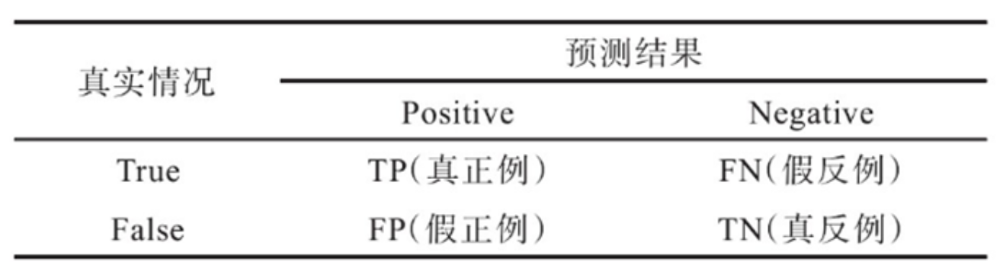

# HOI目标检测的一些先验知识

## 数据集

- 1.传统数据集
  - ***sports event***:博涵8种体育赛事，使用大量语义级标签描述场景和对象。
  - ***TUHOI***：人物交互数据集，由于动词的语法时态以及一词多义现象带来映射偏差，导致验证时难以区分语言理解错误和HOI检测错误。
  - ***HICO***：收录来自80个对象的117种常见行为，该数据集以物体为中心。
  &nbsp;
- 2.实例数据集
  - ***V-COCO数据集***：V-COCO针对每一类别的单目标进行实例分割，并为每张图提供了5种文字描述，由Microsoft COCO派生而来，由2533副图像训练集、2867副图像验证集和4946副图像测试集，总共10346副图像，包含16199个人的实例，每个带注释的人含有26个动作标签，80个对象类别。
  - ***HICO-DET***：使用无向边作为交互类标签，将人与物体的实例框相连接，专门用于HOI研究任务的基准数据集，来自于HICO的扩充，共有47776副图像，其中38118用于训练，9658用于测试，该数据集与V-COCO 是人物交互检测领域中公认的两大基准数据集。
  - HAKE：是人物交互领域最新发布的数据集，
  - ***HOI-A***：来自真实场景，包含不同的外观类型，低分辨率，具有严重遮挡的图像，识别难度较大，由38668个带注释的图像 组成，包含11中交互物体和10中交互动作，HOI-A数据集中每种类型的交互分为室内、室外和车内三种场景，包括了黑暗、自然和强烈的三种照明条件，以及各种不同的角度。

## 评价指标
1. 预测的人类边框与其真实边框（ground truth）之间的IoU大于或等于0.5;
   &nbsp;
2. 预测的物体边框与真实的物体边框之间的IoU大于或等于0.5;
   &nbsp;
3. 预测出的人与物体之间的交互动作与标签标注的真实发生的交互动作一致。

被判断为真阳性TP ***（true positive）***: 表示模型的预测结果与样本的真实类别一致均是正例；
FN ***(False negative)***:模型预测是反例，样本实际是正例；
FP ***False Positive***：预测是正例，样本实际是反例；
TN ***True Negative***：预测是反例，样本实际是反例；

使用平均精度mAP来评估HOI检测，是AP的平均值，计算AP需要用到混淆矩阵。

***准确率***表示真正样本占人-物体交互检测模型预测出的全部正样本比例：
$$
Precision = \frac{TP}{TP+FP}
$$
***召回率***表示真实的正样本中，人-物体交互检测模型为正确的正样本所占有的比例
$$
Recall = \frac{TP}{TP+FN}
$$
***AP***：所有准确率和占该类别的图像数量的比例，评价的是在单个类别上模型判断结果的好坏（p表示准确率，r表示召回率）
$$
AP = \int_0^1 p(r)dr
$$
***mAP*** 指的是平均精确率（AP）的平均值，它衡量的是在所有类别上模型判断结果的好坏。（c表示HOI类的总数）
$$
mAP = \frac{AP}{c}
$$
